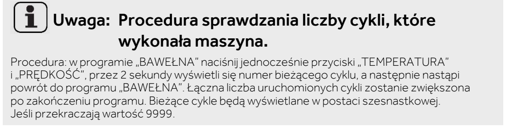

# Sprawdź licznik prań

**Candy BP 49SBL8-S · Przy sprawdzaniu terminu samoczyszczenia**

[Zdjęcie urządzenia](../zdjecia.md#candy)

1. Włącz pralkę i wybierz program BAWEŁNA.
2. Naciśnij jednocześnie TEMPERATURA i PRĘDKOŚĆ.
3. Odczytaj liczbę cykli: pojawi się na około 2 sekundy, potem wyświetlacz wróci do programu BAWEŁNA.

Samoczyszczenie: [l16 — BĘBEN CZYSTY](l16.md).

## Fragment instrukcji producenta

Dotknij rysunku, aby go powiększyć.

**Sprawdzenie liczby wykonanych cykli — s. 21.**

## Źródło i pełna instrukcja

- [Pełna instrukcja — Candy BP 49SBL8-S](../manuals/candy-bp-49sbl8-s.pdf): strona PDF 21.

[Wróć do listy sprzątania](../../README.md#pralka) · [Wszystkie krótkie instrukcje](README.md)
