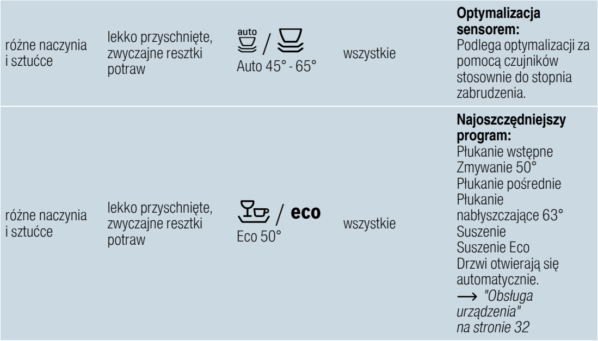

# k10 — Wstaw naczynia do zmywarki

**Siemens SR656D00TE · Co tydzień**

1. Wstaw naczynia do zmywarki.
2. Wybierz Eco 50°C albo Auto 45–65°C i uruchom zmywanie.

## Fragment instrukcji producenta

Dotknij rysunku, aby go powiększyć.

**Nagłówki tabeli programów — s. 29.**

**Programy Auto 45–65°C i Eco 50°C — s. 29.**

## Źródło i pełna instrukcja

- [Pełna instrukcja — Siemens SR656D00TE/01 i /51](../manuals/siemens-sr656d00te.pdf): strona PDF 29.
- [Wersje instrukcji i pełny E-Nr](../manuals/README.md#siemens).

[Wróć do listy sprzątania](../../README.md#pomieszczenia) · [Wszystkie krótkie instrukcje](README.md)
