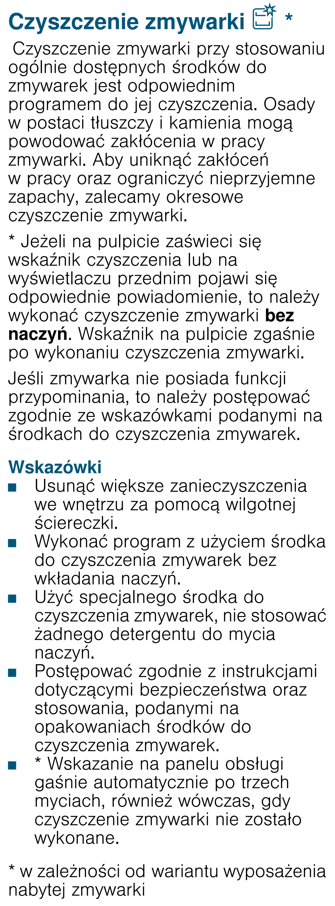

# k12 — Uruchom czyszczenie zmywarki

**Siemens SR656D00TE · Przy komunikacie / według etykiety środka; sprawdź co miesiąc**

> Nie dodawaj zwykłego detergentu do mycia naczyń.

1. Opróżnij zmywarkę. Usuń luźne resztki wilgotną ściereczką i [wyczyść filtr (k17)](k17.md).
2. Zastosuj środek do czyszczenia zmywarek zgodnie z jego etykietą.
3. Uruchom Machine Care / Czyszczenie zmywarki 70°C bez naczyń.

## Fragment instrukcji producenta

Dotknij rysunku, aby go powiększyć.

**Czyszczenie zmywarki: pusty wsad i specjalny środek — s. 40.**

**Program Czyszczenie zmywarki 70°C — s. 30.**

## Źródło i pełna instrukcja

- [Pełna instrukcja — Siemens SR656D00TE/01 i /51](../manuals/siemens-sr656d00te.pdf): strony PDF 30, 40.
- [Wersje instrukcji i pełny E-Nr](../manuals/README.md#siemens).

[Wróć do listy sprzątania](../../README.md#pomieszczenia) · [Wszystkie krótkie instrukcje](README.md)
