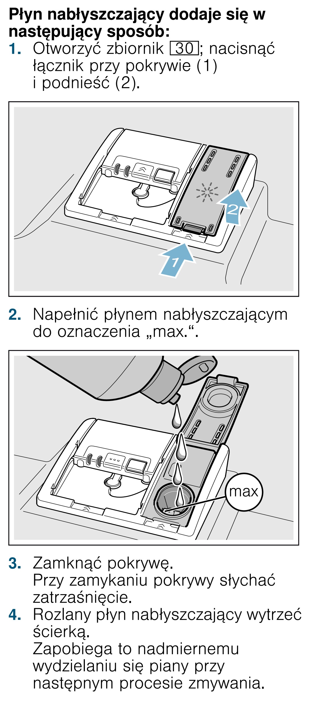

# k13 — Uzupełnij nabłyszczacz

**Siemens SR656D00TE · Gdy świeci kontrolka; sprawdź co tydzień**

1. Gdy świeci kontrolka nabłyszczacza, otwórz pokrywę zbiornika po wewnętrznej stronie drzwi: naciśnij zatrzask i podnieś pokrywę.
2. Wlej nabłyszczacz do zmywarek do oznaczenia MAX.
3. Zamknij pokrywę do zatrzaśnięcia i wytrzyj rozlany płyn, żeby nie tworzyła się piana.

## Fragment instrukcji producenta

Dotknij rysunku, aby go powiększyć.

**Uzupełnianie nabłyszczacza do MAX i wycieranie rozlanego płynu — s. 17.**

## Źródło i pełna instrukcja

- [Pełna instrukcja — Siemens SR656D00TE/01 i /51](../manuals/siemens-sr656d00te.pdf): strona PDF 17.
- [Wersje instrukcji i pełny E-Nr](../manuals/README.md#siemens).

[Wróć do listy sprzątania](../../README.md#pomieszczenia) · [Wszystkie krótkie instrukcje](README.md)
