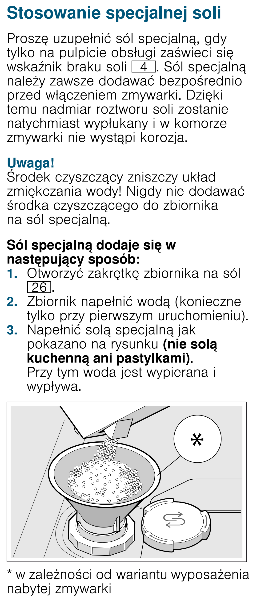

# k14 — Uzupełnij sól w zmywarce

**Siemens SR656D00TE · Gdy świeci kontrolka; sprawdź co tydzień**

> Do zbiornika soli nie wsypuj detergentu, soli kuchennej ani soli w tabletkach.

1. Gdy świeci kontrolka soli, odkręć zakrętkę zbiornika na dnie zmywarki.
2. Wsyp specjalną sól do zmywarek, jak na rysunku, i zamknij zbiornik. Wodę dolewa się tylko przy pierwszym uruchomieniu urządzenia.
3. Od razu uruchom zmywanie, aby wypłukać rozlany roztwór soli i zapobiec korozji.

## Fragment instrukcji producenta

Dotknij rysunku, aby go powiększyć.

**Sól: uzupełnianie bezpośrednio przed zmywaniem — s. 16.**

## Źródło i pełna instrukcja

- [Pełna instrukcja — Siemens SR656D00TE/01 i /51](../manuals/siemens-sr656d00te.pdf): strona PDF 16.
- [Wersje instrukcji i pełny E-Nr](../manuals/README.md#siemens).

[Wróć do listy sprzątania](../../README.md#pomieszczenia) · [Wszystkie krótkie instrukcje](README.md)
