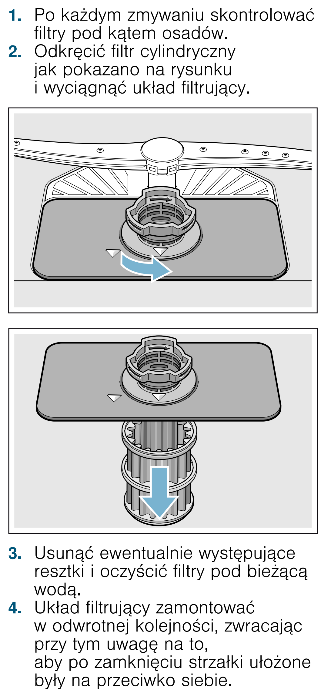

# k17 — Sprawdź i umyj filtr zmywarki

**Siemens SR656D00TE · Po każdym zmywaniu**

1. Wyłącz i odłącz zmywarkę od zasilania przed demontażem części.
2. Po zmywaniu sprawdź, czy filtry są zabrudzone.
3. Jeśli wymagają mycia, odkręć filtr cylindryczny i wyjmij cały układ filtrujący zgodnie z rysunkiem.
4. Usuń resztki, rozłóż filtry i wypłucz je pod bieżącą wodą.
5. Złóż i zamontuj filtry. Po zamknięciu strzałki muszą być naprzeciw siebie.

Wykonaj też przy każdej wizycie, minimum raz w tygodniu.

## Fragment instrukcji producenta

Dotknij rysunku, aby go powiększyć.

**Wyjęcie, płukanie i prawidłowe zamknięcie filtrów — s. 41.**

## Źródło i pełna instrukcja

- [Pełna instrukcja — Siemens SR656D00TE/01 i /51](../manuals/siemens-sr656d00te.pdf): strona PDF 41.
- [Wersje instrukcji i pełny E-Nr](../manuals/README.md#siemens).

[Wróć do listy sprzątania](../../README.md#pomieszczenia) · [Wszystkie krótkie instrukcje](README.md)
