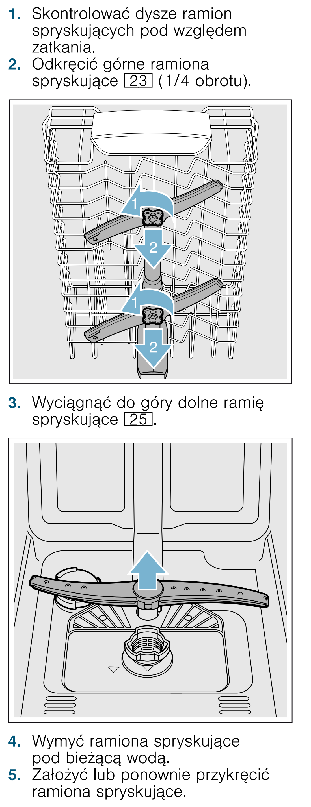

# k18 — Sprawdź ramiona spryskujące zmywarki

**Siemens SR656D00TE · Co miesiąc / gdy dysze zatkane**

1. Wyłącz i odłącz zmywarkę od zasilania przed demontażem części.
2. Sprawdź, czy dysze ramion nie są zatkane.
3. Jeśli wymagają czyszczenia, górne ramię odkręć o ¼ obrotu; dolne wyciągnij do góry.
4. Wypłucz ramiona i dysze pod bieżącą wodą.
5. Zamontuj ramiona z powrotem: dolne zatrzaśnij, górne przykręć.

## Fragment instrukcji producenta

Dotknij rysunku, aby go powiększyć.

**Demontaż, płukanie i ponowny montaż ramion spryskujących — s. 41.**

## Źródło i pełna instrukcja

- [Pełna instrukcja — Siemens SR656D00TE/01 i /51](../manuals/siemens-sr656d00te.pdf): strona PDF 41.
- [Wersje instrukcji i pełny E-Nr](../manuals/README.md#siemens).

[Wróć do listy sprzątania](../../README.md#pomieszczenia) · [Wszystkie krótkie instrukcje](README.md)
