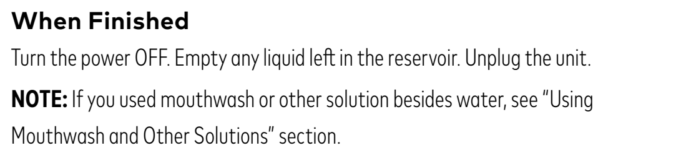
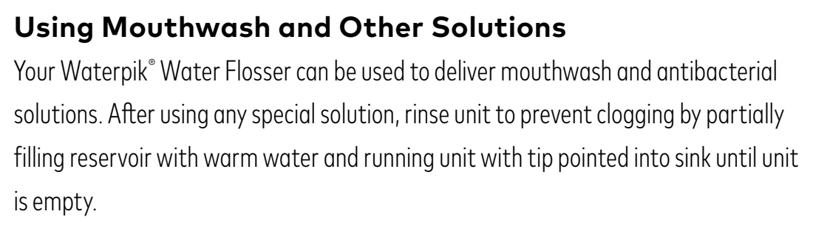

# l11a — Opróżnij zbiornik

**Waterpik WP-660 Ultra Professional · Po każdym użyciu**

[Zdjęcie urządzenia](../zdjecia.md#waterpik)

1. Po użyciu płukanki wlej do zbiornika trochę czystej ciepłej wody. Skieruj końcówkę do umywalki i przepompuj wodę do opróżnienia zbiornika.
2. Wyłącz urządzenie, wylej pozostałą ciecz ze zbiornika i odłącz zasilanie.

Wykonaj też przy każdej wizycie, minimum raz w tygodniu.

## Fragment instrukcji producenta

Dotknij rysunku, aby go powiększyć.

**Po użyciu: wyłącz, opróżnij zbiornik i odłącz zasilanie — instrukcja, s. 7 (EN).**

**Płukanie po użyciu płynu do ust — instrukcja, s. 9 (EN).**

## Źródło i pełna instrukcja

- [Pełna instrukcja — Waterpik WP-660EU / WP-600 Series](../manuals/waterpik-wp-660eu.pdf): strony PDF 7, 9.

[Wróć do listy sprzątania](../../README.md#waterpik) · [Wszystkie krótkie instrukcje](README.md)
