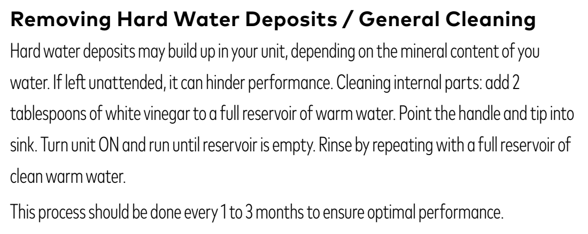

# l11d — Odkamień irygator

**Waterpik WP-660 Ultra Professional · Co miesiąc**

[Zdjęcie urządzenia](../zdjecia.md#waterpik)

1. Do pełnego zbiornika ciepłej wody dodaj 2 łyżki stołowe białego octu.
2. Skieruj rączkę z końcówką do umywalki. Włącz urządzenie i przepompuj całą zawartość zbiornika.
3. Napełnij zbiornik czystą ciepłą wodą i przepompuj całość do umywalki, aby wypłukać układ. Wyłącz urządzenie.

## Fragment instrukcji producenta

Dotknij rysunku, aby go powiększyć.

**Odkamienianie: 2 łyżki octu na pełny zbiornik i końcowe płukanie — instrukcja, s. 9 (EN).**

## Źródło i pełna instrukcja

- [Pełna instrukcja — Waterpik WP-660EU / WP-600 Series](../manuals/waterpik-wp-660eu.pdf): strona PDF 9.

[Wróć do listy sprzątania](../../README.md#waterpik) · [Wszystkie krótkie instrukcje](README.md)
