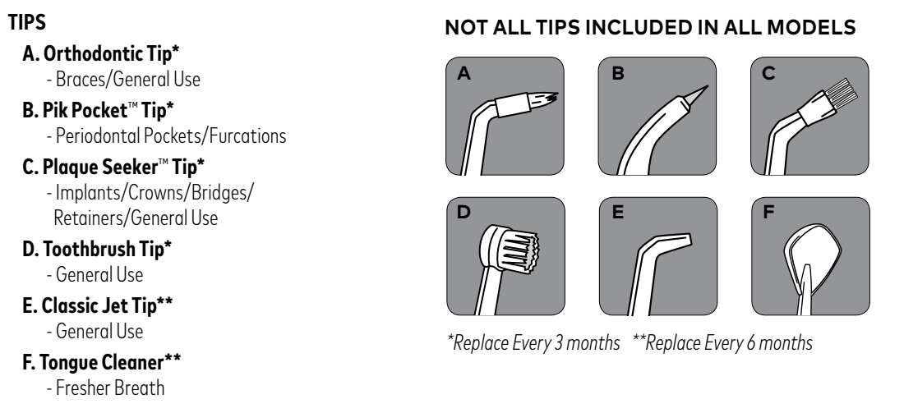

# l11e — Wymień końcówki specjalistyczne

**Waterpik WP-660 Ultra Professional · Co 3 miesiące, jeśli używane**

[Zdjęcie urządzenia](../zdjecia.md#waterpik)

1. Co 3 miesiące wymień używane końcówki: A — Orthodontic, B — Pik Pocket, C — Plaque Seeker, D — końcówka-szczoteczka.
2. Dopasuj rodzaj końcówki do rysunku A–D w legendzie poniżej.

## Fragment instrukcji producenta

Dotknij rysunku, aby go powiększyć.

**Rozpoznaj końcówkę po literze A–F. Gwiazdka: wymiana co 3 miesiące; dwie gwiazdki: co 6 miesięcy — instrukcja, s. 5 (EN).**

## Źródło i pełna instrukcja

- [Pełna instrukcja — Waterpik WP-660EU / WP-600 Series](../manuals/waterpik-wp-660eu.pdf): strona PDF 5.

[Wróć do listy sprzątania](../../README.md#waterpik) · [Wszystkie krótkie instrukcje](README.md)
