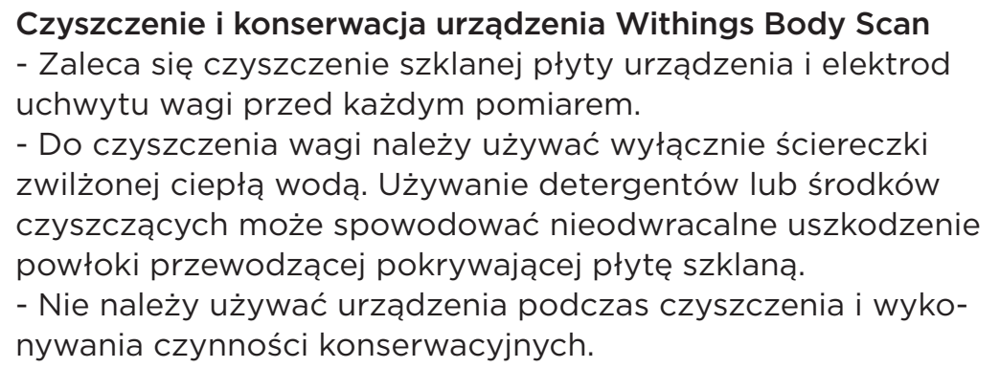

# l12 — Wyczyść wagę Withings Body Scan Black

**Withings Body Scan Black · Przed pomiarem / przy każdej wizycie**

[Zdjęcie urządzenia](../zdjecia.md#withings)

> Bez detergentów i środków czyszczących — mogą trwale uszkodzić powłokę. Nie wykonuj pomiaru podczas czyszczenia.

1. Zwilż niestrzępiącą się ściereczkę ciepłą wodą.
2. Przetrzyj szklaną płytę wagi i elektrody uchwytu.

## Fragment instrukcji producenta

Dotknij rysunku, aby go powiększyć.

**Czyszczenie szklanej płyty i elektrod uchwytu — polska instrukcja, s. 98.**

## Źródło i pełna instrukcja

- [Pełna instrukcja — Withings Body Scan — EU](../manuals/withings-body-scan-eu.pdf): strona PDF 50.
- [Polski skrót poradnika Withings](../manuals/withings-cleaning.md).

[Wróć do listy sprzątania](../../README.md#sprzet) · [Wszystkie krótkie instrukcje](README.md)
