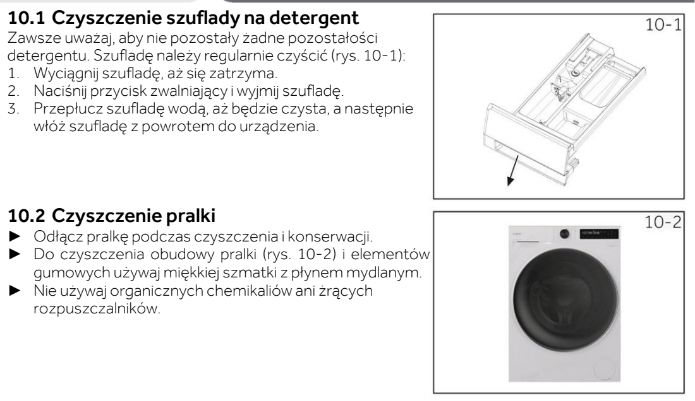

# l15 — Umyj szufladę; przetrzyj uszczelkę i obudowę

**Candy BP 49SBL8-S · Co miesiąc**

[Zdjęcie urządzenia](../zdjecia.md#candy)

> Bez żrących środków i rozpuszczalników.

1. Wyłącz pralkę, wyjmij wtyczkę z gniazdka i zakręć dopływ wody.
2. Wysuń szufladę do oporu, naciśnij zatrzask i wyjmij ją. Wypłucz pozostałości detergentu i włóż szufladę z powrotem.
3. Uszczelkę i obudowę przetrzyj miękką ściereczką z wodą z mydłem.

## Fragment instrukcji producenta

Dotknij rysunku, aby go powiększyć.

**Szuflada na detergent oraz obudowa i elementy gumowe — s. 31.**

## Źródło i pełna instrukcja

- [Pełna instrukcja — Candy BP 49SBL8-S](../manuals/candy-bp-49sbl8-s.pdf): strona PDF 31.

[Wróć do listy sprzątania](../../README.md#pralka) · [Wszystkie krótkie instrukcje](README.md)
