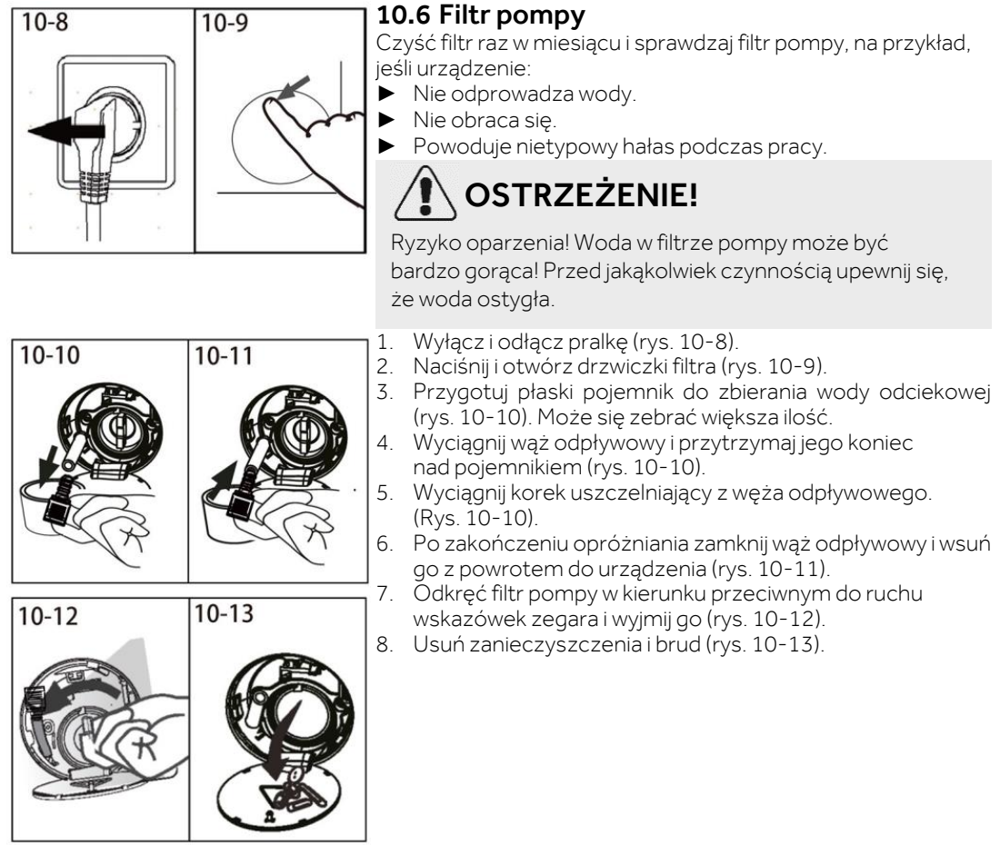
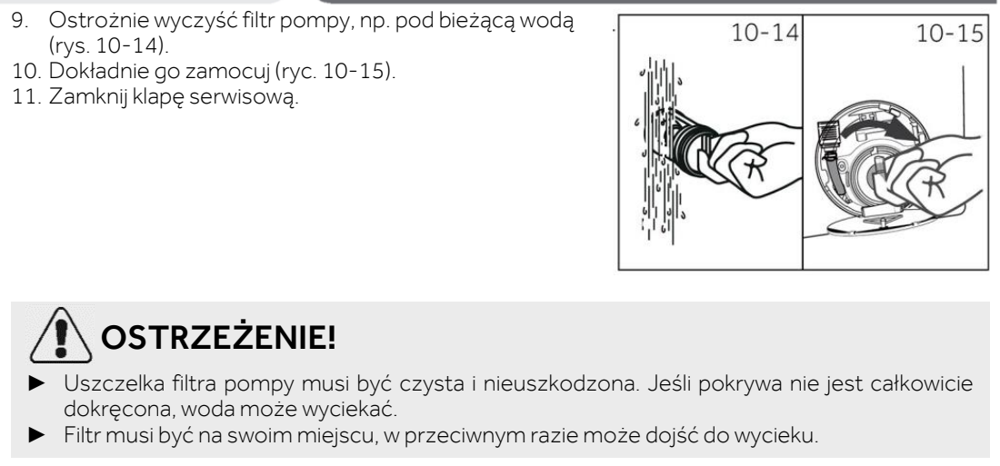

# l18 — Wyczyść filtr pompy odpływowej

**Candy BP 49SBL8-S · Co miesiąc**

[Zdjęcie urządzenia](../zdjecia.md#candy)

> Gorąca woda grozi oparzeniem. Źle dokręcony filtr lub uszkodzona uszczelka mogą spowodować wyciek.

1. Wyłącz pralkę, wyjmij wtyczkę, zakręć dopływ wody i poczekaj, aż woda ostygnie.
2. Otwórz klapkę filtra. Przygotuj płaską miskę — wody może być dużo.
3. Wyciągnij wężyk, skieruj go do miski i wyjmij korek. Spuść całą wodę, zatkaj wężyk i schowaj go.
4. Odkręć filtr w lewo, usuń zanieczyszczenia i wypłucz filtr pod bieżącą wodą.
5. Oczyść i sprawdź uszczelkę. Dokładnie dokręć filtr i zamknij klapkę.

## Fragment instrukcji producenta

Dotknij rysunku, aby go powiększyć.

**Filtr pompy: ostudzenie i spuszczenie wody, wyjęcie filtra — s. 32.**

**Płukanie, dokręcenie i kontrola uszczelki — s. 33.**

## Źródło i pełna instrukcja

- [Pełna instrukcja — Candy BP 49SBL8-S](../manuals/candy-bp-49sbl8-s.pdf): strony PDF 32, 33.

[Wróć do listy sprzątania](../../README.md#pralka) · [Wszystkie krótkie instrukcje](README.md)
