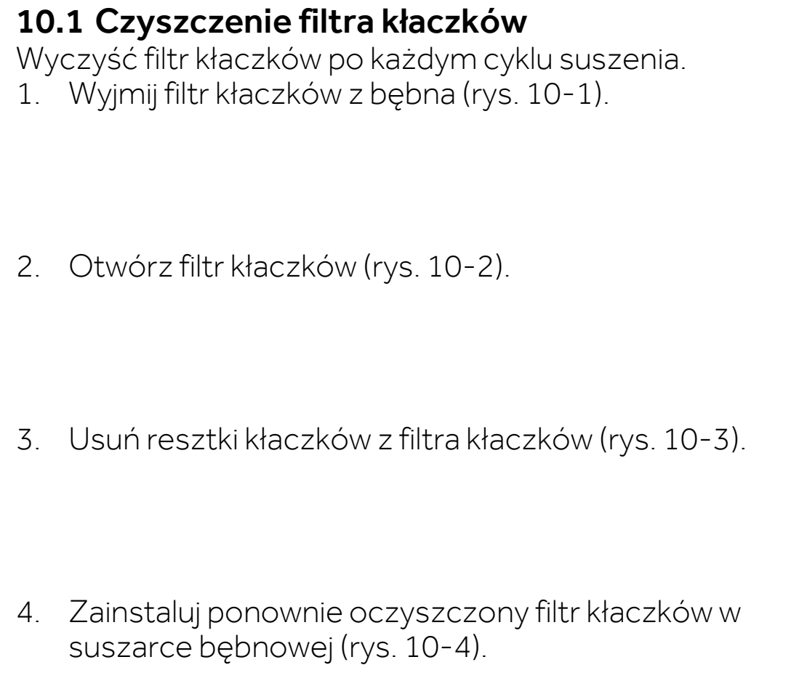
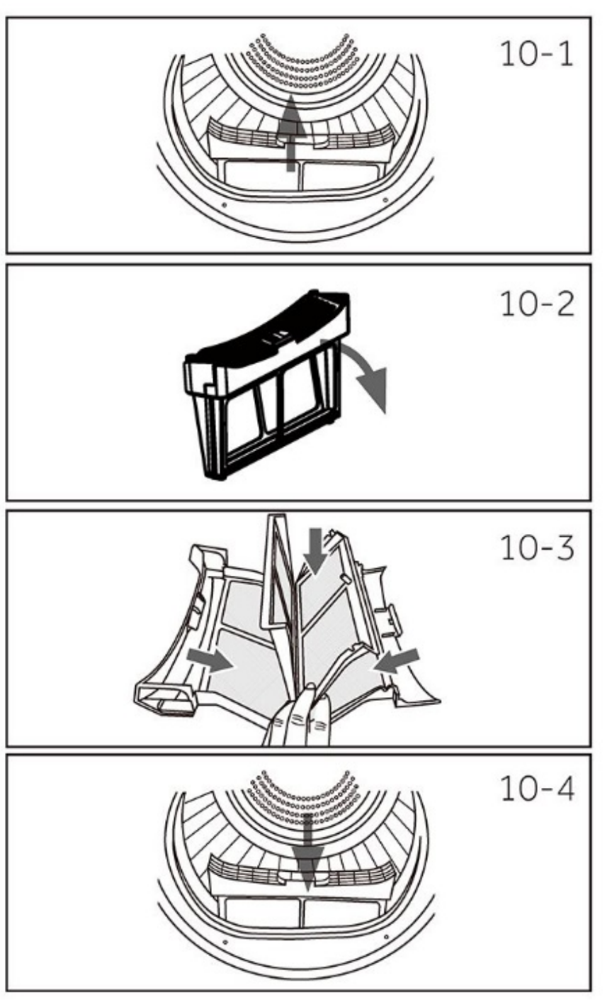
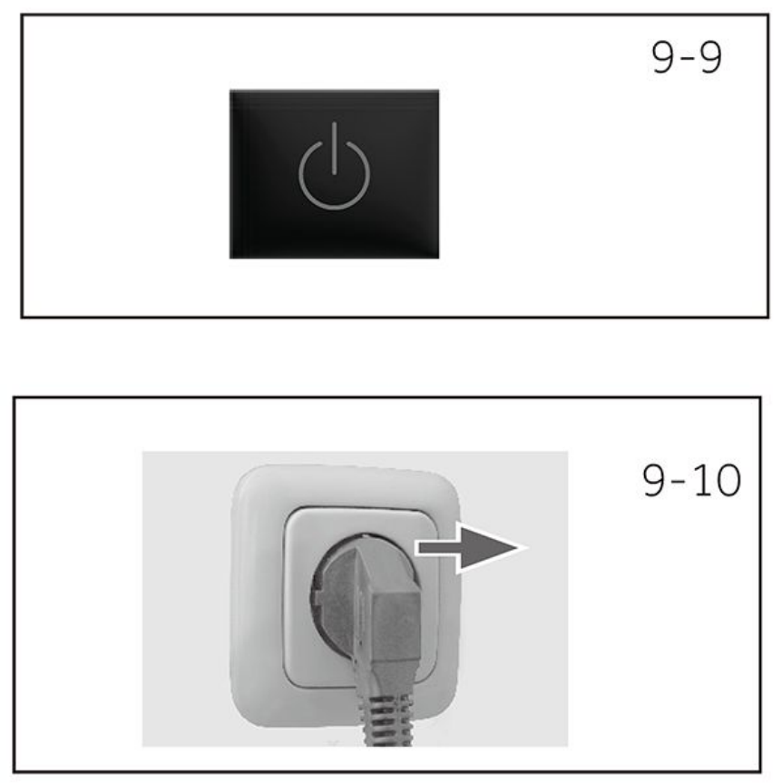

# l19 — Usuń kłaczki z filtra i jego wnęki

**Candy BPS 8N2BX-S · Po każdym suszeniu**

[Zdjęcie urządzenia](../zdjecia.md#candy)

> Mocno zabrudzony filtr można wypłukać. Przed ponownym użyciem musi całkowicie wyschnąć.

1. Po zakończeniu cyklu wyłącz suszarkę i wyjmij wtyczkę z gniazdka.
2. Wyjmij i otwórz filtr przy otworze bębna. Usuń kłaczki z filtra oraz jego wnęki.
3. Zamknij filtr i włóż go z powrotem.

Wykonaj też przy każdej wizycie, minimum raz w tygodniu.

## Fragment instrukcji producenta

Dotknij rysunku, aby go powiększyć.

**Filtr kłaczków: wyjęcie, otwarcie i oczyszczenie — s. 23.**

**Filtr kłaczków: rysunki 10-1–10-4 — s. 23.**

**Po płukaniu filtry muszą całkowicie wyschnąć — s. 23.**

**Po zakończeniu cyklu: wyłącz i odłącz suszarkę — s. 22.**

**Przycisk zasilania i odłączenie wtyczki: rysunki 9-9 i 9-10 — s. 22.**

## Źródło i pełna instrukcja

- [Pełna instrukcja — Candy BPS 8N2BX-S](../manuals/candy-bps-8n2bx-s.pdf): strony PDF 54, 55.

[Wróć do listy sprzątania](../../README.md#suszarka) · [Wszystkie krótkie instrukcje](README.md)
