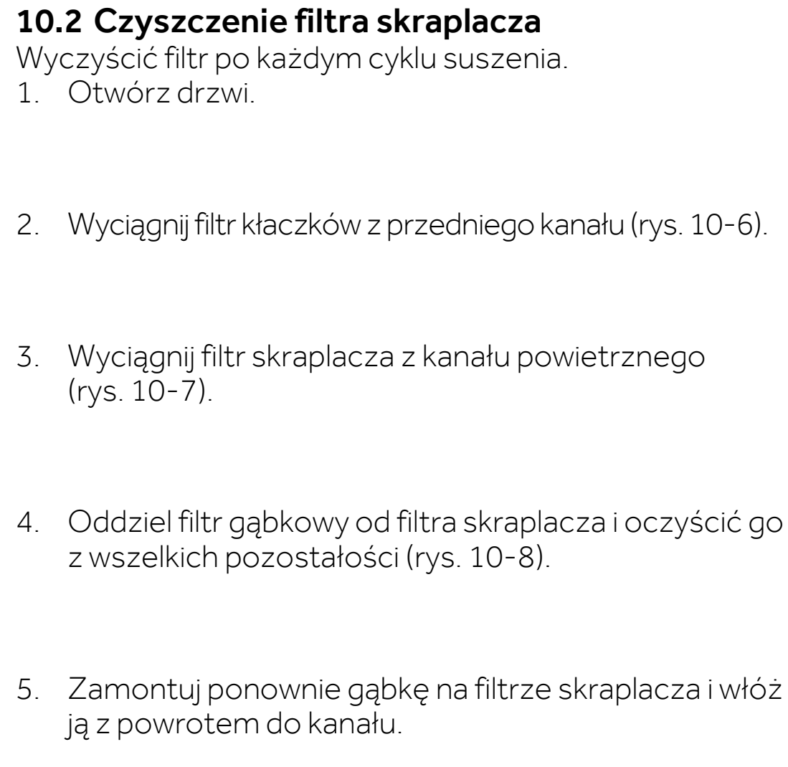
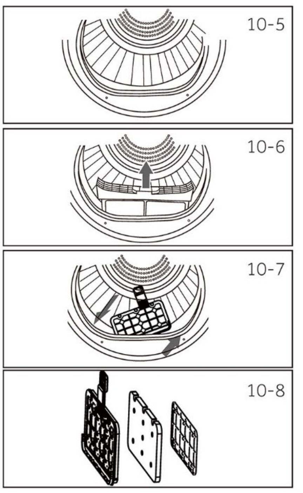

# l20 — Wyczyść drugi filtr — skraplacza z gąbką

**Candy BPS 8N2BX-S · Po każdym suszeniu**

[Zdjęcie urządzenia](../zdjecia.md#candy)

> Mocno zabrudzony filtr można wypłukać. Przed ponownym użyciem wszystkie części muszą całkowicie wyschnąć.

1. Po zakończeniu cyklu wyłącz suszarkę i wyjmij wtyczkę z gniazdka.
2. Otwórz drzwi i wyjmij filtr kłaczków. Spod niego wyjmij filtr skraplacza.
3. Oddziel gąbkę od filtra skraplacza. Oczyść gąbkę i filtr z pozostałości.
4. Załóż gąbkę na filtr skraplacza, zamontuj go w kanale i włóż filtr kłaczków.

Wykonaj też przy każdej wizycie, minimum raz w tygodniu.

## Fragment instrukcji producenta

Dotknij rysunku, aby go powiększyć.

**Filtr skraplacza z gąbką: wyjęcie i oczyszczenie — s. 23.**

**Filtr skraplacza z gąbką: rysunki 10-5–10-8 — s. 23.**

**Po płukaniu filtry muszą całkowicie wyschnąć — s. 23.**

**Po zakończeniu cyklu: wyłącz i odłącz suszarkę — s. 22.**

**Przycisk zasilania i odłączenie wtyczki: rysunki 9-9 i 9-10 — s. 22.**

## Źródło i pełna instrukcja

- [Pełna instrukcja — Candy BPS 8N2BX-S](../manuals/candy-bps-8n2bx-s.pdf): strony PDF 54, 55.

[Wróć do listy sprzątania](../../README.md#suszarka) · [Wszystkie krótkie instrukcje](README.md)
