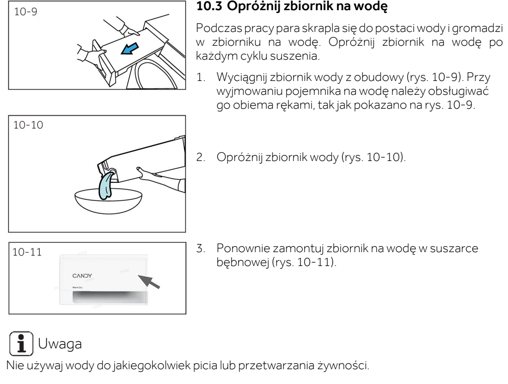

# l21 — Opróżnij zbiornik na wodę

**Candy BPS 8N2BX-S · Po każdym suszeniu**

[Zdjęcie urządzenia](../zdjecia.md#candy)

> Woda ze zbiornika nie nadaje się do picia ani przygotowywania żywności.

1. Po zakończeniu cyklu wyłącz suszarkę i wyjmij wtyczkę z gniazdka.
2. Wysuń zbiornik u góry po lewej. Podtrzymuj go obiema rękami.
3. Wylej wodę i wsuń zbiornik z powrotem do końca.

Wykonaj też przy każdej wizycie, minimum raz w tygodniu.

## Fragment instrukcji producenta

Dotknij rysunku, aby go powiększyć.

**Opróżnianie zbiornika po każdym suszeniu — s. 24.**

**Po zakończeniu cyklu: wyłącz i odłącz suszarkę — s. 22.**

**Przycisk zasilania i odłączenie wtyczki: rysunki 9-9 i 9-10 — s. 22.**

## Źródło i pełna instrukcja

- [Pełna instrukcja — Candy BPS 8N2BX-S](../manuals/candy-bps-8n2bx-s.pdf): strony PDF 54, 56.

[Wróć do listy sprzątania](../../README.md#suszarka) · [Wszystkie krótkie instrukcje](README.md)
