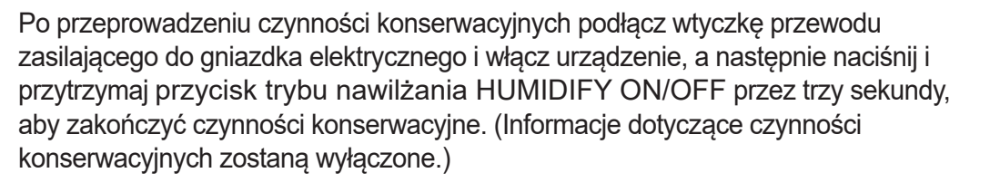
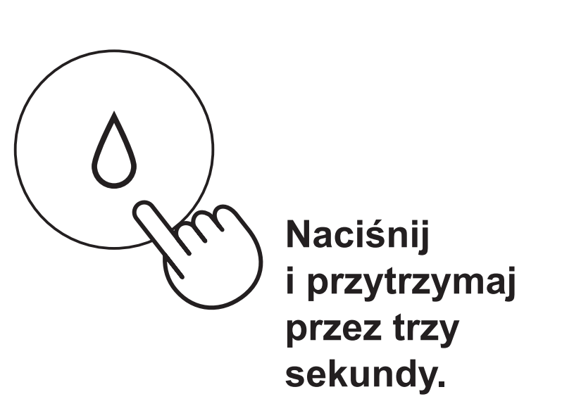

# Skasuj komunikat Maintenance po konserwacji

**Sharp KI-TX100EU-W · Po zakończeniu wszystkich czynności konserwacyjnych**

[Zdjęcie urządzenia](../zdjecia.md#sharp)

1. Po wykonaniu wszystkich czynności konserwacyjnych podłącz oczyszczacz i włącz go.
2. Przytrzymaj HUMIDIFY ON/OFF przez 3 sekundy, aby wyłączyć komunikat Maintenance.

## Fragment instrukcji producenta

Dotknij rysunku, aby go powiększyć.

**Reset przypomnienia dopiero po zakończeniu konserwacji.**

**Przycisk HUMIDIFY ON/OFF: przytrzymaj przez 3 sekundy.**

## Źródło i pełna instrukcja

- [Pełna instrukcja — Sharp KI-TX100EU](../manuals/sharp-ki-tx100eu.pdf): strona PDF 47.

[Wróć do listy sprzątania](../../README.md#sharp) · [Wszystkie krótkie instrukcje](README.md)
