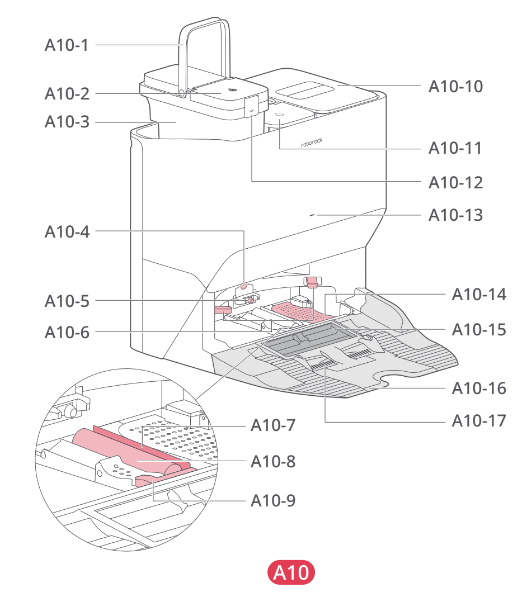

# t1a — Uzupełnij czystą wodę

**Roborock S8 Pro Ultra · W razie potrzeby**

[Zdjęcie urządzenia](../zdjecia.md#roborock)

> Nie używaj gorącej wody. Ewentualny środek do podłóg wyłącznie marki Roborock, zgodnie z jego etykietą.

1. Otwórz zbiornik czystej wody (A10-11 na rysunku) i napełnij go wodą.
2. Zamknij pokrywę, zablokuj zatrzask, wytrzyj pozostałe ślady wody i włóż zbiornik na miejsce.

## Fragment instrukcji producenta

Dotknij rysunku, aby go powiększyć.

**Napełnianie zbiornika czystej wody wraz z uwagami — instrukcja PL, s. 65.**

**Stacja A10: zbiornik czystej wody to A10-11, brudnej wody A10-3 — rysunki, s. 1.**

## Źródło i pełna instrukcja

- [Pełna instrukcja — Roborock S8 Pro Ultra](../manuals/roborock-s8-pro-ultra.pdf): strona PDF 65.
- [Pełna instrukcja — Roborock S8 Pro Ultra — rysunki](../manuals/roborock-s8-pro-ultra-diagrams.pdf): strona PDF 1.

[Wróć do listy sprzątania](../../README.md#roborock) · [Wszystkie krótkie instrukcje](README.md)
