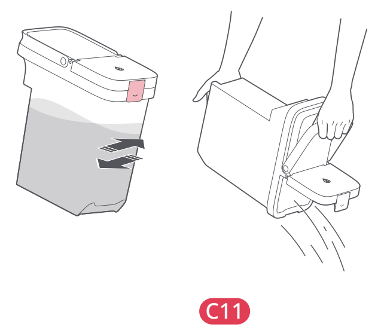

# t1b — Opróżnij i wypłucz zbiornik brudnej wody

**Roborock S8 Pro Ultra · W razie potrzeby**

[Zdjęcie urządzenia](../zdjecia.md#roborock)

> Przed czyszczeniem wyłącz robota i odłącz stację od prądu.

1. Otwórz pokrywę zbiornika brudnej wody i wylej jego zawartość.
2. Nalej czystej wody, zamknij pokrywę i wstrząśnij zbiornikiem. Wylej wodę po płukaniu.
3. Zamknij pokrywę i włóż zbiornik z powrotem do stacji.

## Fragment instrukcji producenta

Dotknij rysunku, aby go powiększyć.

**C11: zbiornik brudnej wody — instrukcja PL, s. 68.**

**C11: opróżnienie zbiornika brudnej wody — rysunki, s. 4.**

## Źródło i pełna instrukcja

- [Pełna instrukcja — Roborock S8 Pro Ultra](../manuals/roborock-s8-pro-ultra.pdf): strona PDF 68.
- [Pełna instrukcja — Roborock S8 Pro Ultra — rysunki](../manuals/roborock-s8-pro-ultra-diagrams.pdf): strona PDF 4.

[Wróć do listy sprzątania](../../README.md#roborock) · [Wszystkie krótkie instrukcje](README.md)
