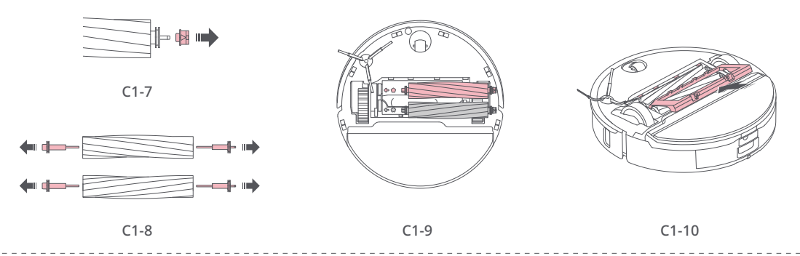

# t2a — Wyczyść szczotki główne

**Roborock S8 Pro Ultra · Co 2 tygodnie**

[Zdjęcie urządzenia](../zdjecia.md#roborock)

> Przed czyszczeniem wyłącz robota i odłącz stację od prądu.

> Nie używaj żrących detergentów ani środków dezynfekcyjnych.

1. Odwróć robota, wciśnij zatrzaski i zdejmij pokrywę szczotek. Wyjmij obie szczotki, łożyska i nasadki.
2. Usuń włosy i zabrudzenia z obu końców. Szczotki przetrzyj wilgotną ściereczką i pozostaw do wyschnięcia poza bezpośrednim słońcem.
3. Zamontuj nasadki, łożyska i szczotki. Dociśnij pokrywę do kliknięcia.

## Fragment instrukcji producenta

Dotknij rysunku, aby go powiększyć.

**C1: szczotki główne — demontaż, czyszczenie i terminy — instrukcja PL, s. 67.**

**C1: położenie szczotek, łożysk i nasadek; otwarcie pokrywy — rysunki, s. 2.**

**C1-7–C1-10: wyjęcie łożysk i nasadek, usunięcie włosów, zamknięcie pokrywy — rysunki, s. 2.**

## Źródło i pełna instrukcja

- [Pełna instrukcja — Roborock S8 Pro Ultra](../manuals/roborock-s8-pro-ultra.pdf): strona PDF 67.
- [Pełna instrukcja — Roborock S8 Pro Ultra — rysunki](../manuals/roborock-s8-pro-ultra-diagrams.pdf): strona PDF 2.

[Wróć do listy sprzątania](../../README.md#roborock) · [Wszystkie krótkie instrukcje](README.md)
