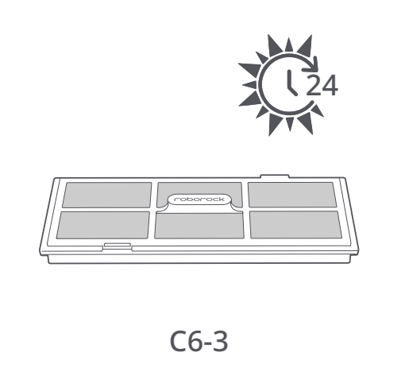

# t2b — Wypłucz filtr robota

**Roborock S8 Pro Ultra · Co 2 tygodnie**

[Zdjęcie urządzenia](../zdjecia.md#roborock)

> Przed czyszczeniem wyłącz robota i odłącz stację od prądu.

> Nie dotykaj powierzchni filtra rękami, szczotką ani twardymi przedmiotami.

1. Otwórz pokrywę filtra i wyjmij filtr.
2. Kilkakrotnie wypłucz filtr i delikatnie w niego postukaj, aby usunąć zanieczyszczenia.
3. Susz filtr przez 24 godziny. Zamontuj dopiero po całkowitym wyschnięciu.

## Fragment instrukcji producenta

Dotknij rysunku, aby go powiększyć.

**C6: filtr zmywalny; suszenie przez 24 godziny — instrukcja PL, s. 68.**

**C6-1–C6-2: wyjęcie i płukanie filtra — rysunki, s. 3.**

**C6-3: suszenie filtra przez 24 godziny — rysunki, s. 3.**

## Źródło i pełna instrukcja

- [Pełna instrukcja — Roborock S8 Pro Ultra](../manuals/roborock-s8-pro-ultra.pdf): strona PDF 68.
- [Pełna instrukcja — Roborock S8 Pro Ultra — rysunki](../manuals/roborock-s8-pro-ultra-diagrams.pdf): strona PDF 3.

[Wróć do listy sprzątania](../../README.md#roborock) · [Wszystkie krótkie instrukcje](README.md)
