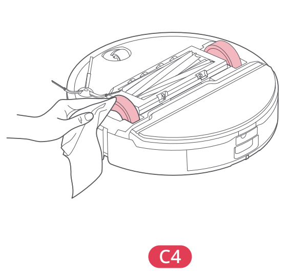

# t2d — Przetrzyj kółka główne

**Roborock S8 Pro Ultra · Co miesiąc**

[Zdjęcie urządzenia](../zdjecia.md#roborock)

> Przed czyszczeniem wyłącz robota i odłącz stację od prądu.

1. Przetrzyj kółka główne miękką, suchą ściereczką.

## Fragment instrukcji producenta

Dotknij rysunku, aby go powiększyć.

**C4: kółka główne — instrukcja PL, s. 67.**

**C4: przetarcie kółka głównego — rysunki, s. 2.**

## Źródło i pełna instrukcja

- [Pełna instrukcja — Roborock S8 Pro Ultra](../manuals/roborock-s8-pro-ultra.pdf): strona PDF 67.
- [Pełna instrukcja — Roborock S8 Pro Ultra — rysunki](../manuals/roborock-s8-pro-ultra-diagrams.pdf): strona PDF 2.

[Wróć do listy sprzątania](../../README.md#roborock) · [Wszystkie krótkie instrukcje](README.md)
