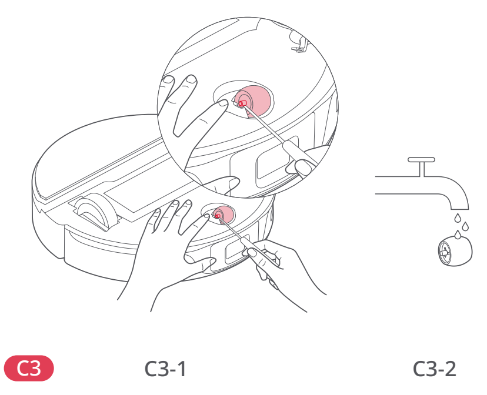

# t2e — Wyczyść małe kółko obrotowe

**Roborock S8 Pro Ultra · W razie potrzeby**

[Zdjęcie urządzenia](../zdjecia.md#roborock)

> Przed czyszczeniem wyłącz robota i odłącz stację od prądu.

> Nie demontuj wspornika kółka.

1. Podważ oś małym śrubokrętem i wyjmij kółko.
2. Wypłucz kółko i oś wodą, usuwając włosy i brud.
3. Dokładnie wysusz; wciśnij kółko z powrotem na miejsce.

## Fragment instrukcji producenta

Dotknij rysunku, aby go powiększyć.

**C3: małe kółko obrotowe; wspornika nie zdejmuj — instrukcja PL, s. 67.**

**C3: wyjęcie, płukanie i ponowne osadzenie małego kółka — rysunki, s. 2.**

## Źródło i pełna instrukcja

- [Pełna instrukcja — Roborock S8 Pro Ultra](../manuals/roborock-s8-pro-ultra.pdf): strona PDF 67.
- [Pełna instrukcja — Roborock S8 Pro Ultra — rysunki](../manuals/roborock-s8-pro-ultra-diagrams.pdf): strona PDF 2.

[Wróć do listy sprzątania](../../README.md#roborock) · [Wszystkie krótkie instrukcje](README.md)
