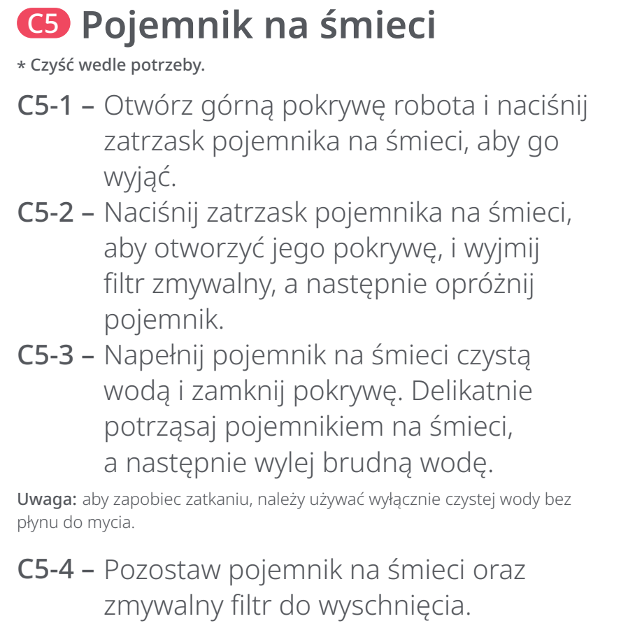
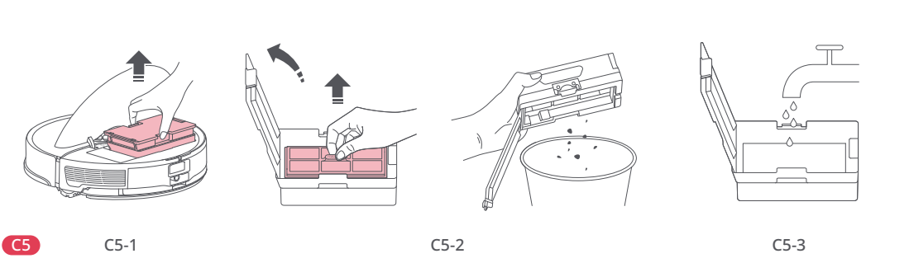
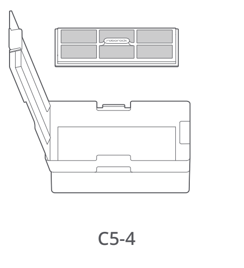

# t2f — Opróżnij i umyj pojemnik na kurz

**Roborock S8 Pro Ultra · W razie potrzeby**

[Zdjęcie urządzenia](../zdjecia.md#roborock)

> Przed czyszczeniem wyłącz robota i odłącz stację od prądu.

> Do pojemnika używaj tylko czystej wody, bez płynu do mycia.

1. Otwórz górną pokrywę robota; wciśnij zatrzask i wyjmij pojemnik.
2. Otwórz pokrywę pojemnika, wyjmij zmywalny filtr i opróżnij pojemnik.
3. Napełnij pojemnik czystą wodą, zamknij, delikatnie potrząśnij i wylej brudną wodę.
4. Pozostaw pojemnik i filtr do wyschnięcia. Jeżeli płuczesz filtr, susz go przez 24 godziny — zobacz zadanie t2b.

## Fragment instrukcji producenta

Dotknij rysunku, aby go powiększyć.

**C5: pojemnik na kurz — instrukcja PL, s. 68.**

**C5-1–C5-3: wyjęcie i opróżnienie pojemnika, wyjęcie filtra, płukanie — rysunki, s. 3.**

**C5-4: pozostawienie pojemnika do wyschnięcia — rysunki, s. 3.**

## Źródło i pełna instrukcja

- [Pełna instrukcja — Roborock S8 Pro Ultra](../manuals/roborock-s8-pro-ultra.pdf): strona PDF 68.
- [Pełna instrukcja — Roborock S8 Pro Ultra — rysunki](../manuals/roborock-s8-pro-ultra-diagrams.pdf): strona PDF 3.

[Wróć do listy sprzątania](../../README.md#roborock) · [Wszystkie krótkie instrukcje](README.md)
