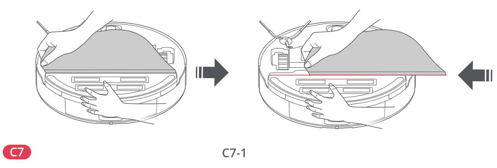

# t2g — Wyczyść ściereczkę mopa

**Roborock S8 Pro Ultra · W razie potrzeby**

[Zdjęcie urządzenia](../zdjecia.md#roborock)

> Przed czyszczeniem wyłącz robota i odłącz stację od prądu.

> Mocowanie mopa pozostaje na robocie; zdejmij tylko ściereczkę.

1. Zdejmij samą ściereczkę z mocowania VibraRise.
2. Wyczyść ściereczkę i pozostaw do wyschnięcia na powietrzu. Przed użyciem upewnij się, że jest czysta.

## Fragment instrukcji producenta

Dotknij rysunku, aby go powiększyć.

**C7: ściereczka mopa — instrukcja PL, s. 68.**

**C7: zdejmij samą ściereczkę mopa — rysunki, s. 3.**

## Źródło i pełna instrukcja

- [Pełna instrukcja — Roborock S8 Pro Ultra](../manuals/roborock-s8-pro-ultra.pdf): strona PDF 68.
- [Pełna instrukcja — Roborock S8 Pro Ultra — rysunki](../manuals/roborock-s8-pro-ultra-diagrams.pdf): strona PDF 3.

[Wróć do listy sprzątania](../../README.md#roborock) · [Wszystkie krótkie instrukcje](README.md)
