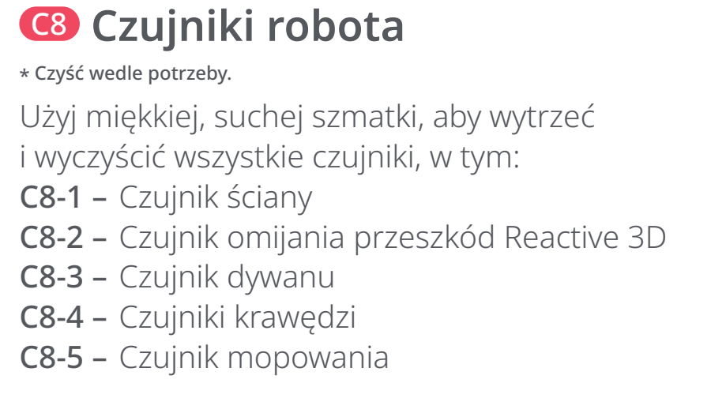
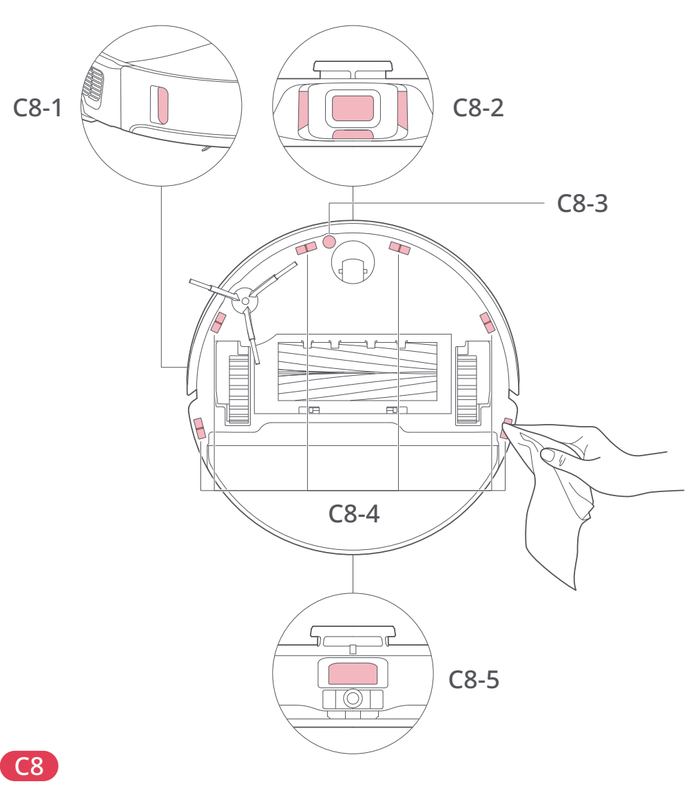
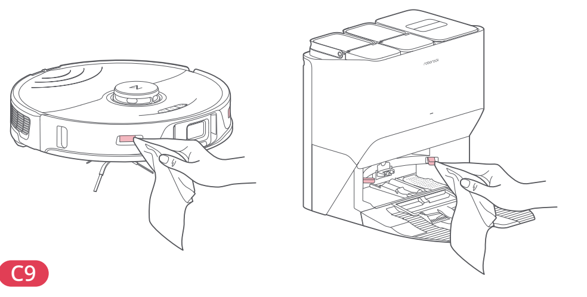

# t2h — Przetrzyj czujniki i styki ładowania

**Roborock S8 Pro Ultra · W razie potrzeby**

[Zdjęcie urządzenia](../zdjecia.md#roborock)

> Przed czyszczeniem wyłącz robota i odłącz stację od prądu.

> Do czujników i styków używaj wyłącznie miękkiej, suchej ściereczki.

1. Miękką, suchą ściereczką przetrzyj czujnik ściany, omijania przeszkód Reactive 3D, dywanu, krawędzi i mopowania — lokalizacje C8-1–C8-5 poniżej.
2. Tą samą metodą przetrzyj styki ładowania robota i stacji (C9).

## Fragment instrukcji producenta

Dotknij rysunku, aby go powiększyć.

**C8: czujniki robota — instrukcja PL, s. 68.**

**C9: styki ładowania — instrukcja PL, s. 68.**

**C8: położenie pięciu rodzajów czujników — rysunki, s. 3.**

**C9: styki ładowania robota i stacji — rysunki, s. 3.**

## Źródło i pełna instrukcja

- [Pełna instrukcja — Roborock S8 Pro Ultra](../manuals/roborock-s8-pro-ultra.pdf): strona PDF 68.
- [Pełna instrukcja — Roborock S8 Pro Ultra — rysunki](../manuals/roborock-s8-pro-ultra-diagrams.pdf): strona PDF 3.

[Wróć do listy sprzątania](../../README.md#roborock) · [Wszystkie krótkie instrukcje](README.md)
