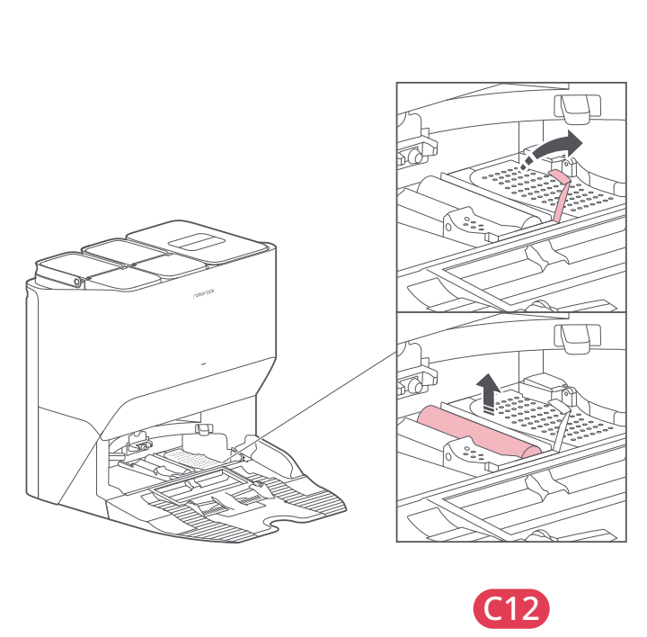

# t2i — Wyczyść szczotkę myjącą stacji

**Roborock S8 Pro Ultra · W razie potrzeby**

[Zdjęcie urządzenia](../zdjecia.md#roborock)

> Przed czyszczeniem wyłącz robota i odłącz stację od prądu.

1. Podnieś zatrzask szczotki myjącej i wyjmij szczotkę zgodnie z rysunkiem C12.
2. Usuń włosy i inne zabrudzenia; opłucz szczotkę.
3. Włóż szczotkę na miejsce i zamknij zatrzask.

## Fragment instrukcji producenta

Dotknij rysunku, aby go powiększyć.

**C12: szczotka myjąca stacji — instrukcja PL, s. 68.**

**C12: wyjmowanie szczotki myjącej stacji — rysunki, s. 4.**

## Źródło i pełna instrukcja

- [Pełna instrukcja — Roborock S8 Pro Ultra](../manuals/roborock-s8-pro-ultra.pdf): strona PDF 68.
- [Pełna instrukcja — Roborock S8 Pro Ultra — rysunki](../manuals/roborock-s8-pro-ultra-diagrams.pdf): strona PDF 4.

[Wróć do listy sprzątania](../../README.md#roborock) · [Wszystkie krótkie instrukcje](README.md)
