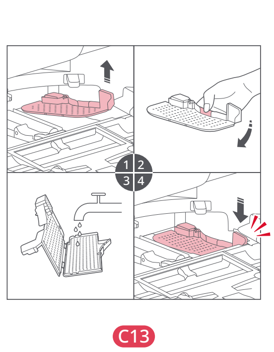

# t2j — Wyczyść filtr wody i komorę myjącą

**Roborock S8 Pro Ultra · W razie potrzeby**

[Zdjęcie urządzenia](../zdjecia.md#roborock)

> Przed czyszczeniem wyłącz robota i odłącz stację od prądu.

1. Odblokuj filtr wody i wyjmij go ze stacji. Otwórz zatrzask filtra i przepłucz filtr.
2. Komorę po wyjętym filtrze wytrzyj miękką, suchą ściereczką.
3. Włóż filtr na miejsce i dociśnij do kliknięcia.

## Fragment instrukcji producenta

Dotknij rysunku, aby go powiększyć.

**C13: filtr wody w stacji — instrukcja PL, s. 68.**

**C13: wyjmowanie i otwieranie filtra wody — rysunki, s. 4.**

## Źródło i pełna instrukcja

- [Pełna instrukcja — Roborock S8 Pro Ultra](../manuals/roborock-s8-pro-ultra.pdf): strona PDF 68.
- [Pełna instrukcja — Roborock S8 Pro Ultra — rysunki](../manuals/roborock-s8-pro-ultra-diagrams.pdf): strona PDF 4.

[Wróć do listy sprzątania](../../README.md#roborock) · [Wszystkie krótkie instrukcje](README.md)
