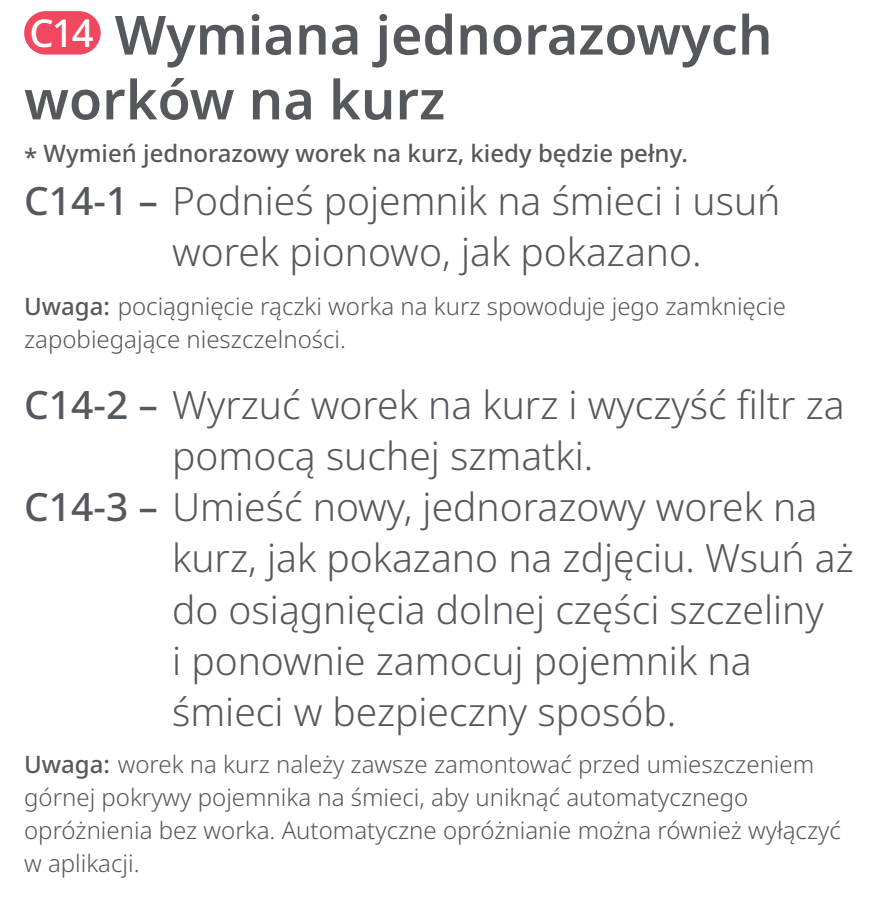
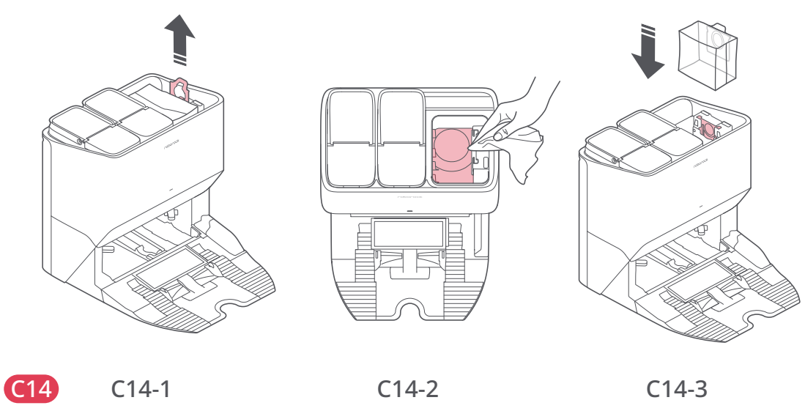

# t2k — Wymień worek na kurz

**Roborock S8 Pro Ultra · Gdy pełny**

[Zdjęcie urządzenia](../zdjecia.md#roborock)

> Przed czyszczeniem wyłącz robota i odłącz stację od prądu.

> Nie uruchamiaj automatycznego opróżniania bez worka.

1. Podnieś pojemnik stacji i wyjmij worek pionowo. Pociągnięcie uchwytu zamyka worek.
2. Wyrzuć zużyty worek. Filtr wewnątrz komory przetrzyj suchą ściereczką.
3. Wsuń nowy worek aż do dna prowadnicy; dopiero potem zamknij pojemnik stacji.

## Fragment instrukcji producenta

Dotknij rysunku, aby go powiększyć.

**C14: wymiana worka; nie uruchamiaj opróżniania bez worka — instrukcja PL, s. 69.**

**C14: wyjęcie zużytego worka i wsunięcie nowego — rysunki, s. 4.**

## Źródło i pełna instrukcja

- [Pełna instrukcja — Roborock S8 Pro Ultra](../manuals/roborock-s8-pro-ultra.pdf): strona PDF 69.
- [Pełna instrukcja — Roborock S8 Pro Ultra — rysunki](../manuals/roborock-s8-pro-ultra-diagrams.pdf): strona PDF 4.

[Wróć do listy sprzątania](../../README.md#roborock) · [Wszystkie krótkie instrukcje](README.md)
