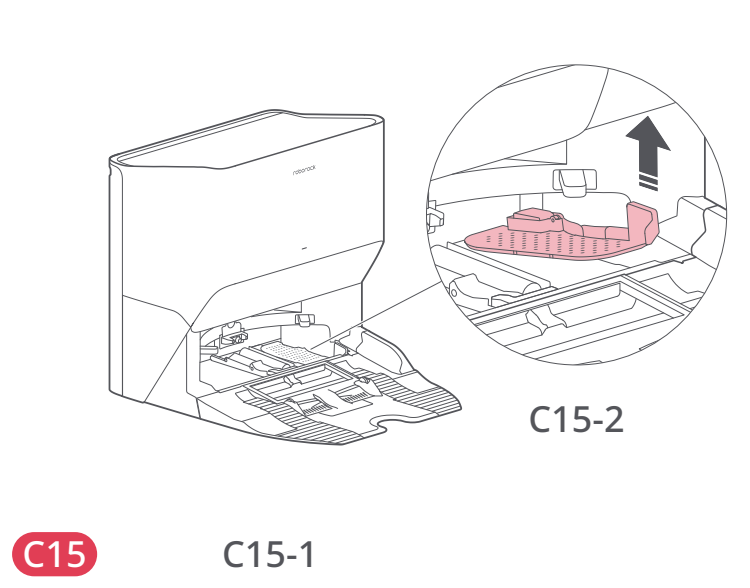
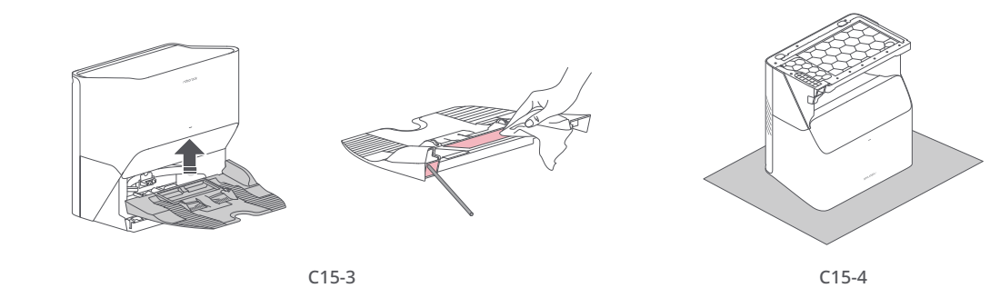
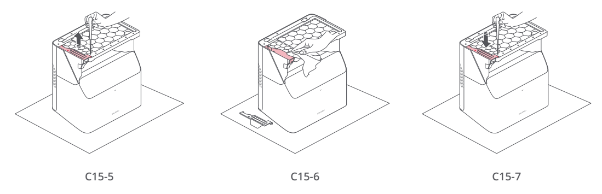

# t2l — Udrożnij kanał zasysający stacji

**Roborock S8 Pro Ultra · Przy blokadzie**

[Zdjęcie urządzenia](../zdjecia.md#roborock)

> Przed czyszczeniem wyłącz robota i odłącz stację od prądu.

> Stację odwracaj dopiero po wyjęciu zbiorników, pojemnika i filtra oraz usunięciu pozostałej wody.

1. Usuń zbiorniki czystej i brudnej wody, pojemnik na kurz oraz filtr wody. Wytrzyj wodę.
2. Chwyć boki podstawy, odłącz ją zgodnie z rysunkiem C15-3 i sprawdź wlot powietrza. Usuń blokadę wacikiem; wytrzyj suchą ściereczką.
3. Ostrożnie odwróć osuszoną stację na twardej podłodze przykrytej miękkim ręcznikiem.
4. Odkręć trzy śruby, zdejmij pokrywę i przetrzyj kanał oraz pokrywę suchą ściereczką.
5. Załóż pokrywę, dokręć śruby i ponownie zamontuj wyjęte elementy.

## Fragment instrukcji producenta

Dotknij rysunku, aby go powiększyć.

**C15: udrażnianie kanału — przygotowanie i kroki 1–3, instrukcja PL, s. 69.**

**C15: udrażnianie kanału — dalsze kroki 4–7, instrukcja PL, s. 69.**

**C15-1–C15-2: usuń zbiorniki, pojemnik i filtr wody — rysunki, s. 4.**

**C15-3–C15-4: odłącz podstawę i ostrożnie odwróć osuszoną stację — rysunki, s. 4.**

**C15-5–C15-7: zdejmij pokrywę, wyczyść kanał i ponownie zamknij — rysunki, s. 4.**

## Źródło i pełna instrukcja

- [Pełna instrukcja — Roborock S8 Pro Ultra](../manuals/roborock-s8-pro-ultra.pdf): strona PDF 69.
- [Pełna instrukcja — Roborock S8 Pro Ultra — rysunki](../manuals/roborock-s8-pro-ultra-diagrams.pdf): strona PDF 4.

[Wróć do listy sprzątania](../../README.md#roborock) · [Wszystkie krótkie instrukcje](README.md)
