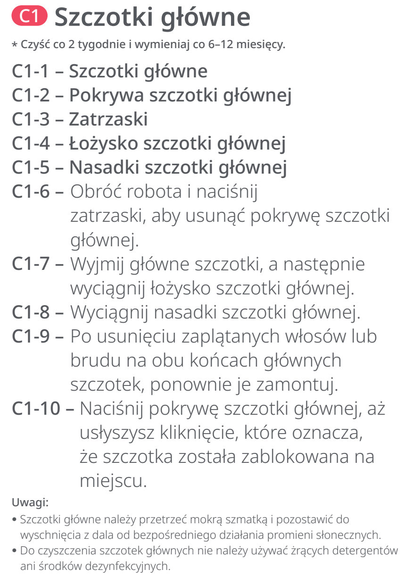
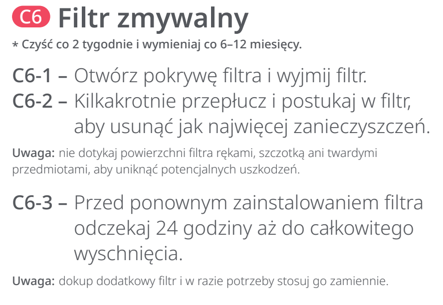
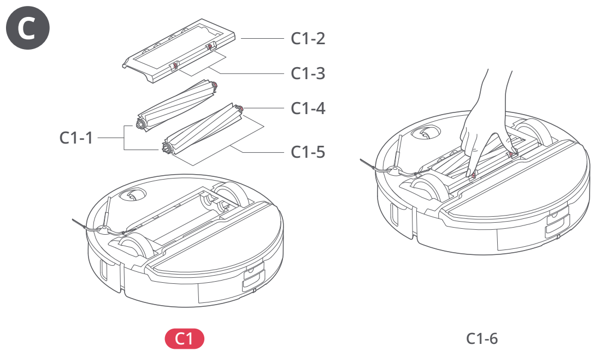
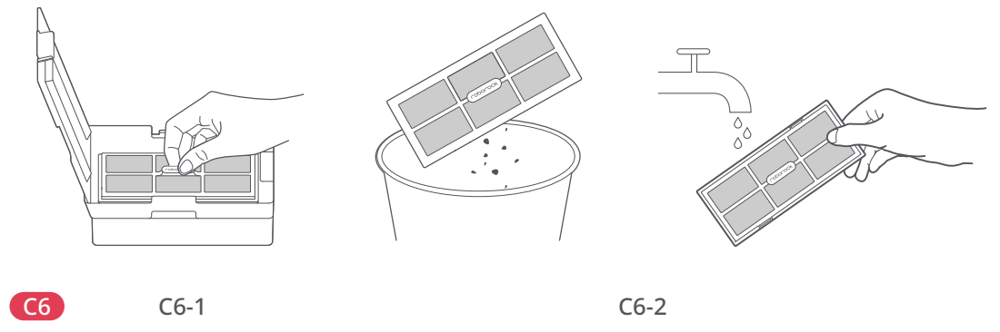

# t2n — Wymień szczotki główne, filtr robota i szczotkę myjącą stacji

**Roborock S8 Pro Ultra · Co 6–12 miesięcy**

[Zdjęcie urządzenia](../zdjecia.md#roborock)

> Przed czyszczeniem wyłącz robota i odłącz stację od prądu.

1. Co 6–12 miesięcy wymień szczotki główne, zmywalny filtr robota i szczotkę myjącą stacji.
2. Szczotki główne: otwórz zatrzaski pokrywy, wyjmij zużyte szczotki, zamontuj nowe i zatrzaśnij pokrywę (C1).
3. Filtr: otwórz pokrywę pojemnika, wyjmij zużyty filtr i włóż nowy suchy filtr (C6).
4. Szczotka stacji: podnieś zatrzask, wyjmij starą szczotkę, włóż nową i zamknij zatrzask (C12).

## Fragment instrukcji producenta

Dotknij rysunku, aby go powiększyć.

**C1: szczotki główne — demontaż, czyszczenie i terminy — instrukcja PL, s. 67.**

**C6: filtr zmywalny; suszenie przez 24 godziny — instrukcja PL, s. 68.**

**C12: szczotka myjąca stacji — instrukcja PL, s. 68.**

**C1: położenie szczotek, łożysk i nasadek; otwarcie pokrywy — rysunki, s. 2.**

**C6-1–C6-2: wyjęcie i płukanie filtra — rysunki, s. 3.**

**C12: wyjmowanie szczotki myjącej stacji — rysunki, s. 4.**

## Źródło i pełna instrukcja

- [Pełna instrukcja — Roborock S8 Pro Ultra](../manuals/roborock-s8-pro-ultra.pdf): strony PDF 67, 68.
- [Pełna instrukcja — Roborock S8 Pro Ultra — rysunki](../manuals/roborock-s8-pro-ultra-diagrams.pdf): strony PDF 2, 3, 4.

[Wróć do listy sprzątania](../../README.md#roborock) · [Wszystkie krótkie instrukcje](README.md)
