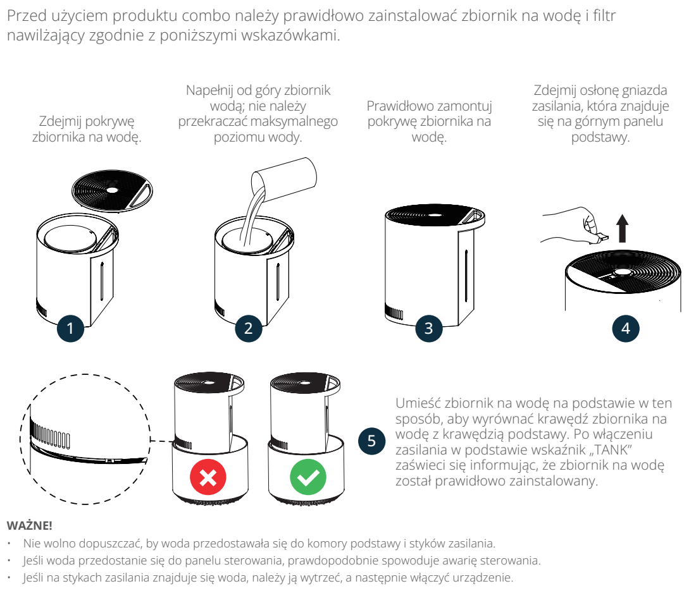

# t3 — Wymień wodę

**Vestfrost VP-H2I40WH · Codziennie podczas używania**

[Zdjęcie urządzenia](../zdjecia.md#vestfrost)

> Przed zdjęciem i ponownym założeniem zbiornika odłącz urządzenie od prądu.

> Nie nalewaj wody do podstawy; styki zasilania muszą być suche przed włączeniem.

> Nie dodawaj olejków do wody.

1. Świeża, oczyszczona woda o temperaturze pokojowej; najwyżej do MAX.

Wykonaj też przy każdej wizycie, minimum raz w tygodniu.

## Fragment instrukcji producenta

Dotknij rysunku, aby go powiększyć.

**Codzienna wymiana wody.**

**Napełnianie zbiornika i prawidłowe osadzenie na podstawie.**

**Zasady bezpiecznego napełniania: odłączone zasilanie, temperatura wody i ochrona podstawy.**

## Źródło i pełna instrukcja

- [Pełna instrukcja — Vestfrost VP-H2I40WH](../manuals/vestfrost-vp-h2i40wh.pdf): strony PDF 4, 10.

[Wróć do listy sprzątania](../../README.md#vestfrost) · [Wszystkie krótkie instrukcje](README.md)
