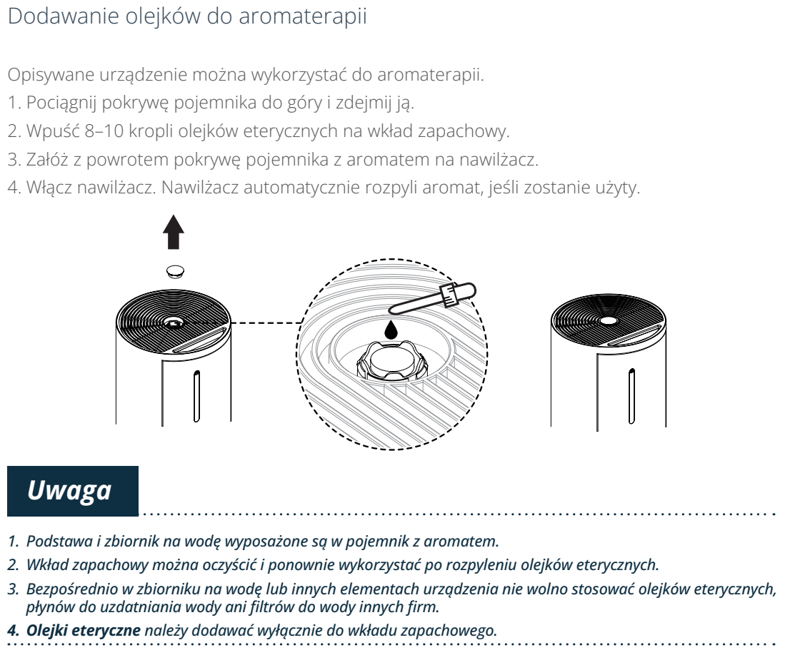

# t4 — Wyczyść wkład zapachowy / dodaj olejek

**Vestfrost VP-H2I40WH · W razie potrzeby**

[Zdjęcie urządzenia](../zdjecia.md#vestfrost)

> Odłącz urządzenie przed czyszczeniem.

> Olejek dodawaj wyłącznie na wkład zapachowy; nigdy do zbiornika z wodą ani na inne elementy urządzenia.

1. Brudny wkład wypłucz, wysusz; olejek 8–10 kropli **tylko na wkład, nigdy do wody**.

## Fragment instrukcji producenta

Dotknij rysunku, aby go powiększyć.

**Przed konserwacją odłącz wtyczkę zasilania.**

**Dodawanie 8–10 kropli olejku wyłącznie na wkład zapachowy; położenie wkładu i uwagi.**

**Zanieczyszczony wkład zapachowy: wypłucz w czystej wodzie i pozostaw do wyschnięcia.**

## Źródło i pełna instrukcja

- [Pełna instrukcja — Vestfrost VP-H2I40WH](../manuals/vestfrost-vp-h2i40wh.pdf): strony PDF 9, 10, 15.

[Wróć do listy sprzątania](../../README.md#vestfrost) · [Wszystkie krótkie instrukcje](README.md)
