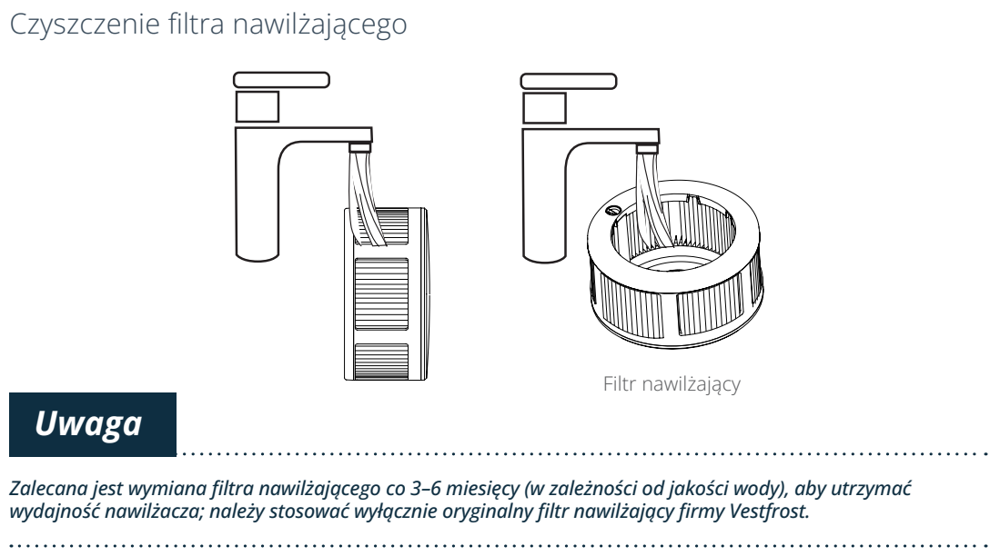
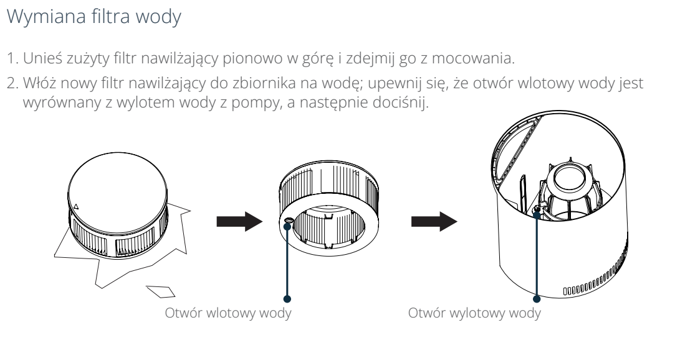

# t5b — Wypłucz filtr nawilżający

**Vestfrost VP-H2I40WH · Co miesiąc**

[Zdjęcie urządzenia](../zdjecia.md#vestfrost)

> Odłącz wtyczkę przed wyjęciem filtra.

1. Odłącz urządzenie i wyjmij filtr nawilżający pionowo w górę z mocowania.
2. Wypłucz filtr pod bieżącą wodą.
3. Włóż filtr z powrotem: wyrównaj otwór wlotowy wody z wylotem pompy i dociśnij.

## Fragment instrukcji producenta

Dotknij rysunku, aby go powiększyć.

**Przed konserwacją odłącz wtyczkę zasilania.**

**Filtry płucz raz w miesiącu.**

**Płukanie filtra nawilżającego pod bieżącą wodą; uwaga o oryginalnym filtrze.**

**Wyjmowanie filtra pionowo i dopasowanie wlotu filtra do wylotu pompy podczas montażu.**

## Źródło i pełna instrukcja

- [Pełna instrukcja — Vestfrost VP-H2I40WH](../manuals/vestfrost-vp-h2i40wh.pdf): strony PDF 9, 10, 11.

[Wróć do listy sprzątania](../../README.md#vestfrost) · [Wszystkie krótkie instrukcje](README.md)
