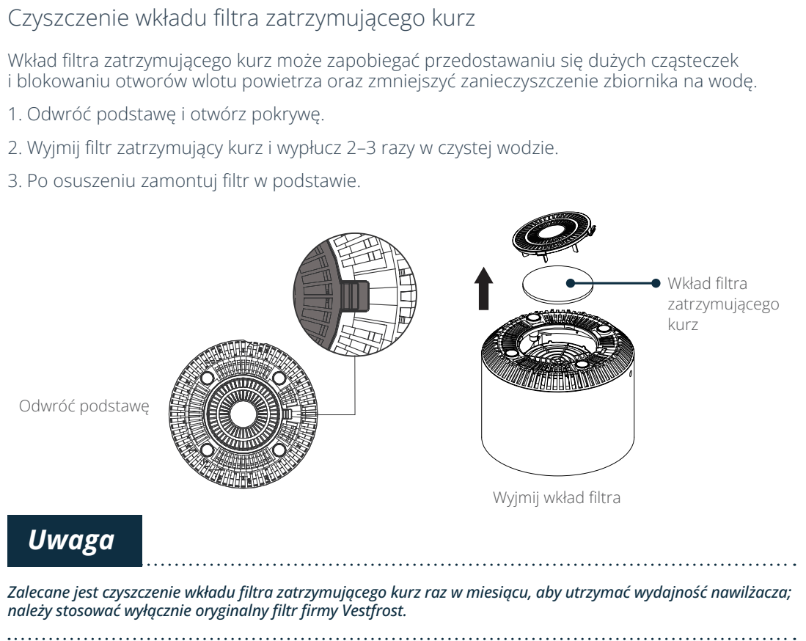

# t5c — Wypłucz dolny filtr przeciwkurzowy

**Vestfrost VP-H2I40WH · Co miesiąc**

[Zdjęcie urządzenia](../zdjecia.md#vestfrost)

> Odłącz wtyczkę przed konserwacją.

> Nie odwracaj urządzenia ze zbiornikiem wody.

1. Odłącz urządzenie; zdejmij zbiornik z podstawy.
2. Odwróć samą podstawę i otwórz pokrywę dolnego filtra.
3. Wyjmij wkład i wypłucz 2–3 razy w czystej wodzie.
4. Osusz wkład i zamontuj go ponownie w podstawie.

## Fragment instrukcji producenta

Dotknij rysunku, aby go powiększyć.

**Przed konserwacją odłącz wtyczkę zasilania.**

**Otwieranie podstawy, wyjęcie filtra przeciwkurzowego, 2–3 płukania i montaż po osuszeniu.**

## Źródło i pełna instrukcja

- [Pełna instrukcja — Vestfrost VP-H2I40WH](../manuals/vestfrost-vp-h2i40wh.pdf): strony PDF 10, 11.

[Wróć do listy sprzątania](../../README.md#vestfrost) · [Wszystkie krótkie instrukcje](README.md)
