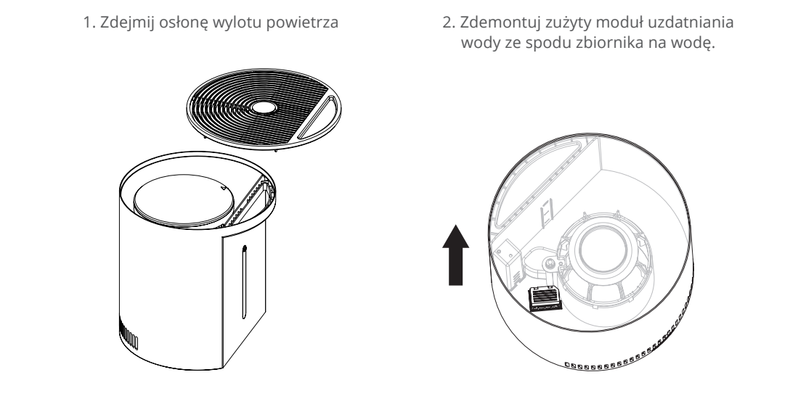
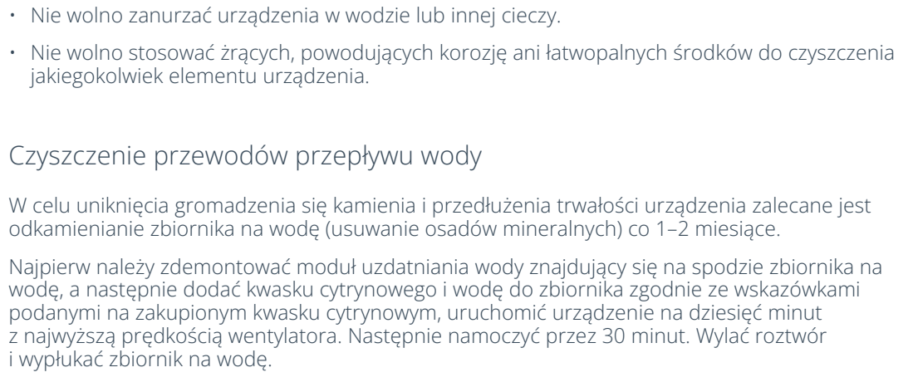

# t5d — Odkamień zbiornik i przewody

**Vestfrost VP-H2I40WH · Co 1–2 miesiące**

[Zdjęcie urządzenia](../zdjecia.md#vestfrost)

> Wyjmij moduł uzdatniania wody przed dodaniem roztworu.

> Odłącz zasilanie przed demontażem oraz przed opróżnieniem i płukaniem zbiornika.

> Nie zanurzaj urządzenia.

1. Wyłącz i odłącz urządzenie. Zdejmij pokrywę i wyjmij moduł uzdatniania wody.
2. Dodaj do zbiornika kwasek cytrynowy i wodę w proporcjach podanych na opakowaniu kwasku.
3. Złóż urządzenie bez modułu uzdatniania. Podłącz i uruchom z maksymalnym nawiewem na 10 minut.
4. Wyłącz i odłącz urządzenie. Pozostaw roztwór na 30 minut.
5. Wylej roztwór i wypłucz zbiornik czystą wodą.
6. Zamontuj moduł uzdatniania we właściwym kierunku i załóż pokrywę.

## Fragment instrukcji producenta

Dotknij rysunku, aby go powiększyć.

**Przed konserwacją odłącz wtyczkę zasilania.**

**Zdjęcie osłony i demontaż modułu uzdatniania przed odkamienianiem.**

**Pełna procedura odkamieniania przewodów i zbiornika oraz ostrzeżenia dotyczące czyszczenia.**

## Źródło i pełna instrukcja

- [Pełna instrukcja — Vestfrost VP-H2I40WH](../manuals/vestfrost-vp-h2i40wh.pdf): strony PDF 10, 12.

[Wróć do listy sprzątania](../../README.md#vestfrost) · [Wszystkie krótkie instrukcje](README.md)
