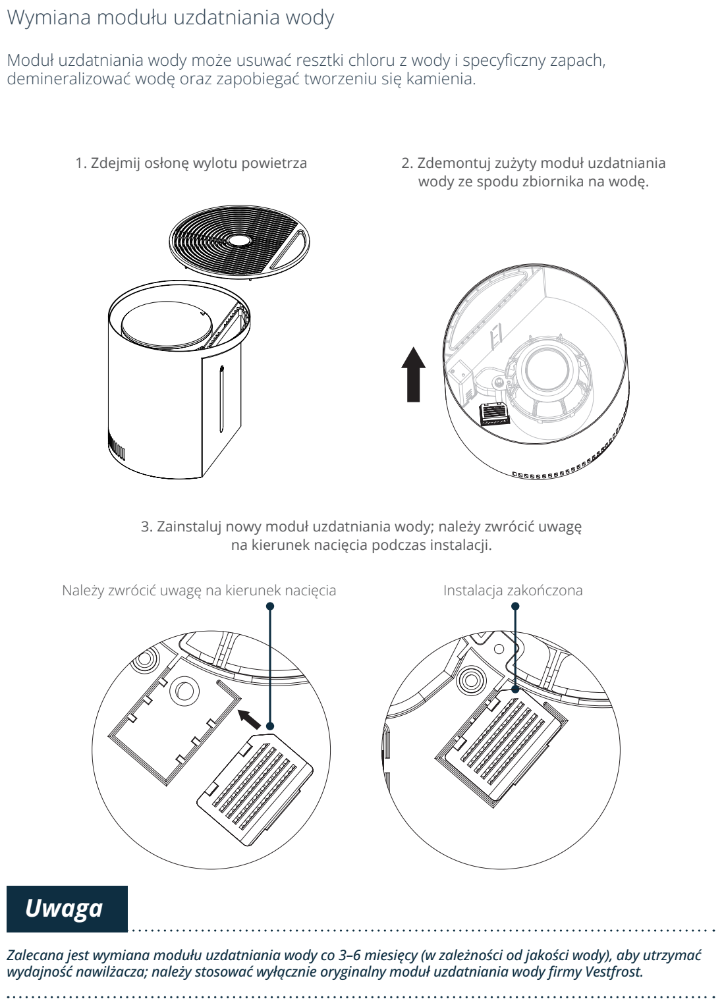

# t5f — Wymień moduł uzdatniania wody

**Vestfrost VP-H2I40WH · Co 3–6 miesięcy, zależnie od wody**

[Zdjęcie urządzenia](../zdjecia.md#vestfrost)

> Odłącz wtyczkę przed wymianą modułu.

1. Odłącz urządzenie i zdejmij osłonę wylotu powietrza.
2. Wyjmij zużyty moduł ze spodu zbiornika na wodę.
3. Załóż nowy oryginalny moduł zgodnie z kierunkiem nacięcia pokazanym na rysunku.

## Fragment instrukcji producenta

Dotknij rysunku, aby go powiększyć.

**Przed konserwacją odłącz wtyczkę zasilania.**

**Pełna procedura wymiany modułu uzdatniania: demontaż, kierunek nacięcia i termin wymiany.**

## Źródło i pełna instrukcja

- [Pełna instrukcja — Vestfrost VP-H2I40WH](../manuals/vestfrost-vp-h2i40wh.pdf): strony PDF 10, 12.

[Wróć do listy sprzątania](../../README.md#vestfrost) · [Wszystkie krótkie instrukcje](README.md)
