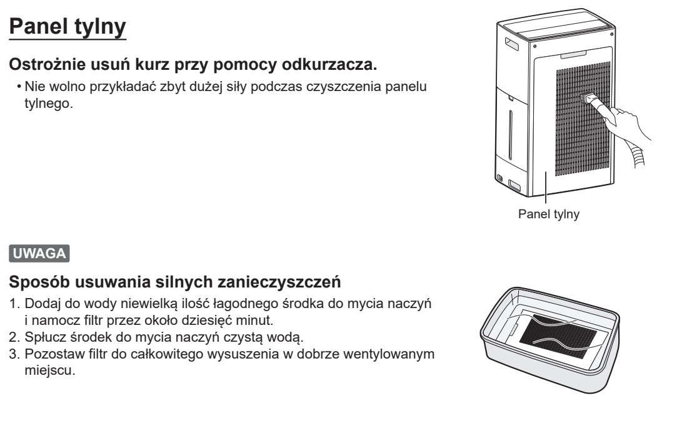
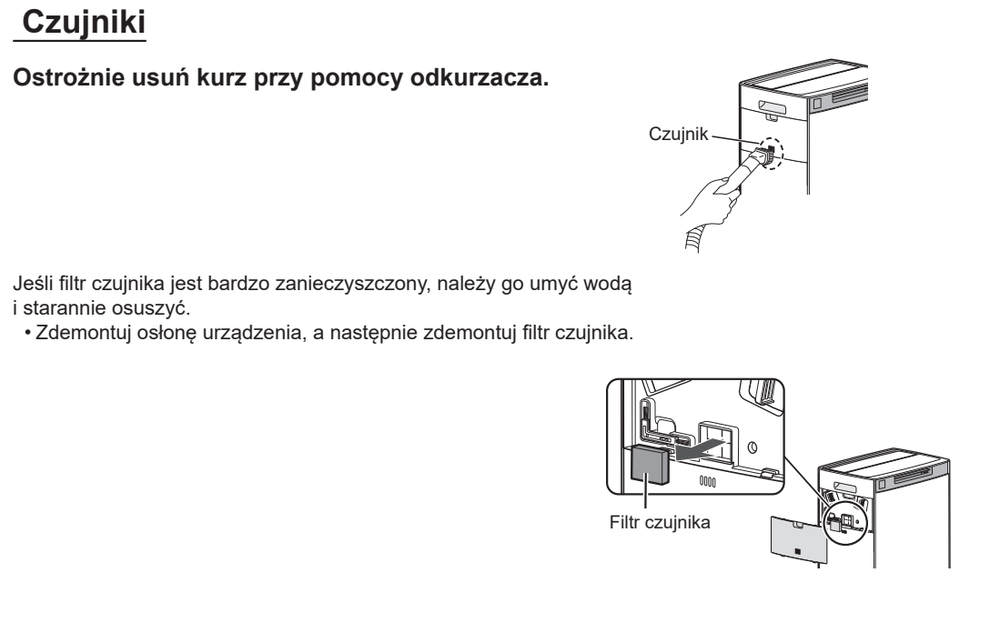

# t6a — Odkurz filtr wstępny i czujniki; przetrzyj obudowę

**Sharp KI-TX100EU-W · Co miesiąc / komunikat Maintenance**

[Zdjęcie urządzenia](../zdjecia.md#sharp)

> Przed ręcznym czyszczeniem wyłącz urządzenie i odłącz je od prądu.

1. Odkurz panel tylny i czujniki; obudowę przetrzyj suchą ściereczką.

Jeśli świeci komunikat Maintenance, po zakończeniu wszystkich czynności konserwacyjnych [skasuj przypomnienie](sharp-reset.md).

## Fragment instrukcji producenta

Dotknij rysunku, aby go powiększyć.

**Panel tylny: odkurzanie i mycie tylko przy silnym zabrudzeniu.**

**Czujniki i ich wyjmowany filtr.**

**Obudowa: sucha, miękka ściereczka.**

## Źródło i pełna instrukcja

- [Pełna instrukcja — Sharp KI-TX100EU](../manuals/sharp-ki-tx100eu.pdf): strony PDF 47, 48.

[Wróć do listy sprzątania](../../README.md#sharp) · [Wszystkie krótkie instrukcje](README.md)
