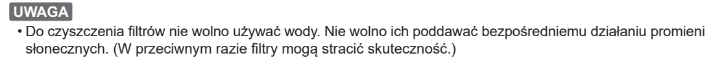
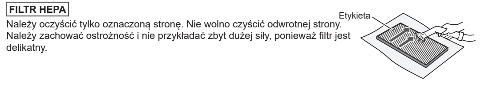

# t6b — Odkurz filtr HEPA

**Sharp KI-TX100EU-W · Sprawdź co miesiąc; czyść przy kurzu**

[Zdjęcie urządzenia](../zdjecia.md#sharp)

> Przed ręcznym czyszczeniem wyłącz urządzenie i odłącz je od prądu.

> Nie używaj wody. Nie wystawiaj filtra na bezpośrednie słońce. Nie czyść strony bez etykiety.

1. Delikatnie odkurz wyłącznie stronę z etykietą. **Bez wody i słońca.**

Jeśli świeci komunikat Maintenance, po zakończeniu wszystkich czynności konserwacyjnych [skasuj przypomnienie](sharp-reset.md).

## Fragment instrukcji producenta

Dotknij rysunku, aby go powiększyć.

**Zakaz mycia wodą i suszenia w słońcu.**

**Filtr HEPA: wyłącznie strona z etykietą.**

## Źródło i pełna instrukcja

- [Pełna instrukcja — Sharp KI-TX100EU](../manuals/sharp-ki-tx100eu.pdf): strona PDF 50.

[Wróć do listy sprzątania](../../README.md#sharp) · [Wszystkie krótkie instrukcje](README.md)
