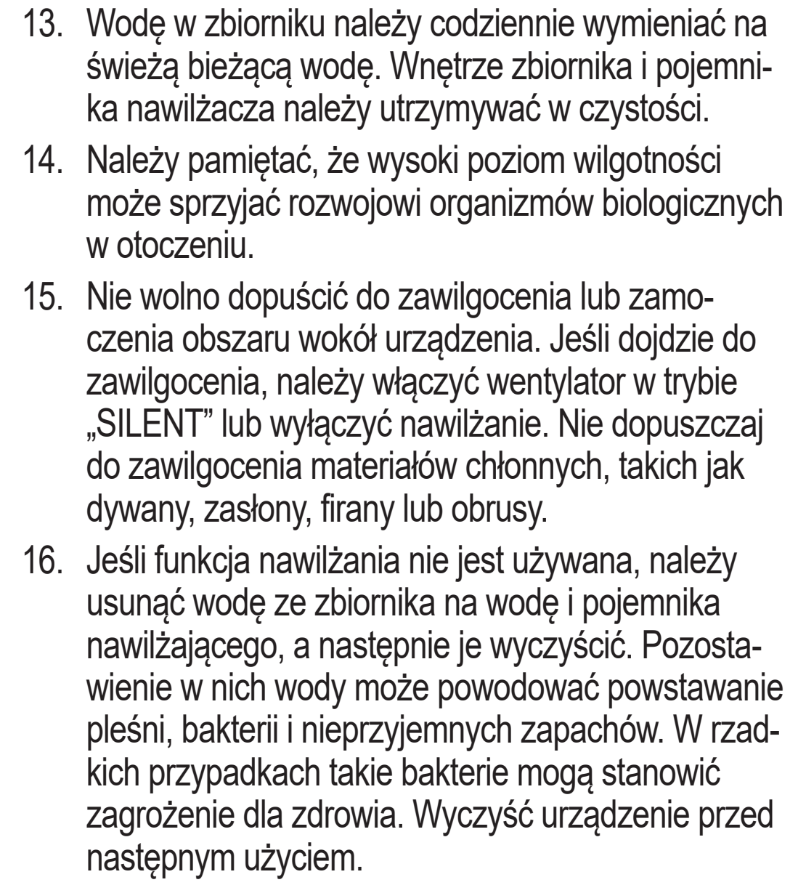
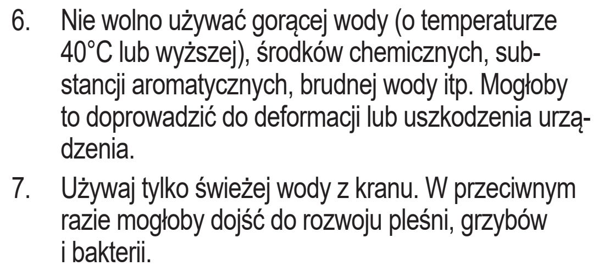
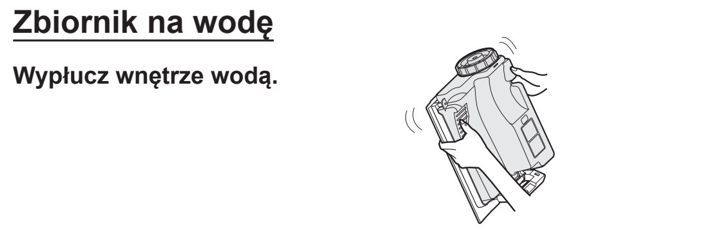
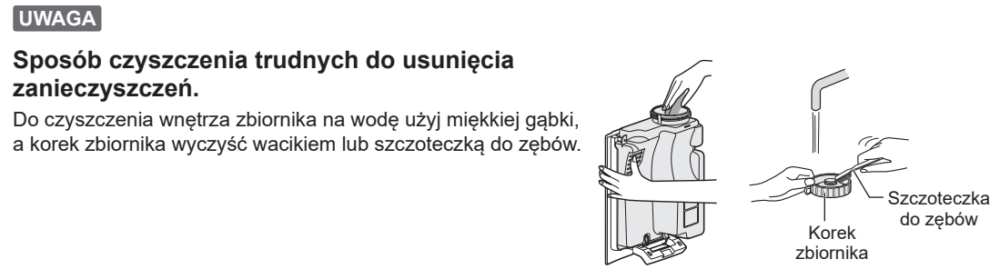

# t6d — Wymień wodę i wypłucz zbiornik

**Sharp KI-TX100EU-W · Codziennie podczas nawilżania**

[Zdjęcie urządzenia](../zdjecia.md#sharp)

> Przed napełnianiem zbiornika i ręcznym czyszczeniem wyłącz urządzenie i odłącz je od prądu.

> Nie używaj wody o temperaturze 40°C lub wyższej ani dodatków zapachowych.

1. Wyłącz i odłącz oczyszczacz. Wylej pozostałą wodę i wypłucz wnętrze zbiornika wodą.
2. Napełnij zbiornik świeżą kranówką i zamontuj go ponownie.
3. Gdy nie używasz nawilżania, opróżnij i wyczyść zbiornik oraz tackę.

Wykonaj też przy każdej wizycie, minimum raz w tygodniu.

## Fragment instrukcji producenta

Dotknij rysunku, aby go powiększyć.

**Codzienna wymiana wody, wilgotność otoczenia i opróżnianie przy nieużywanym nawilżaniu.**

**Do nawilżania tylko świeża kranówka; bez gorącej wody i dodatków.**

**Płukanie wnętrza zbiornika.**

**Usuwanie trudniejszych zabrudzeń zbiornika i korka.**

## Źródło i pełna instrukcja

- [Pełna instrukcja — Sharp KI-TX100EU](../manuals/sharp-ki-tx100eu.pdf): strony PDF 32, 47.

[Wróć do listy sprzątania](../../README.md#sharp) · [Wszystkie krótkie instrukcje](README.md)
