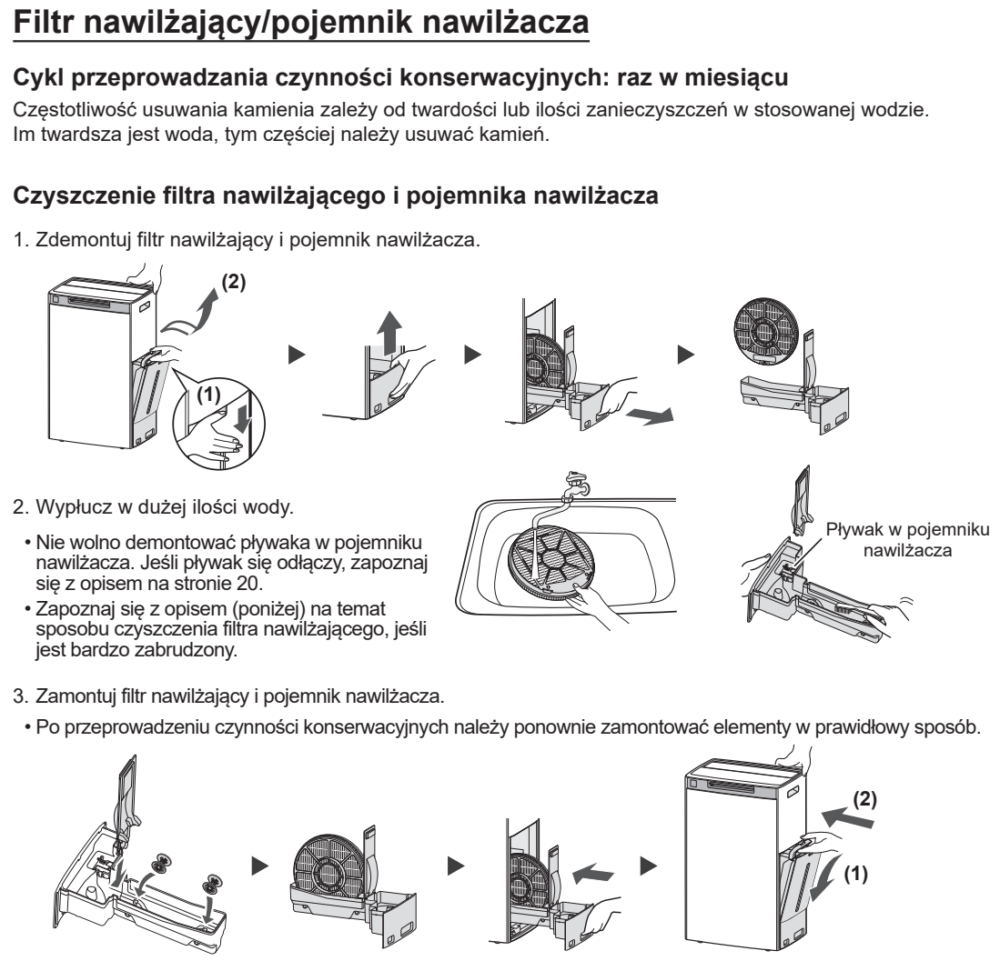
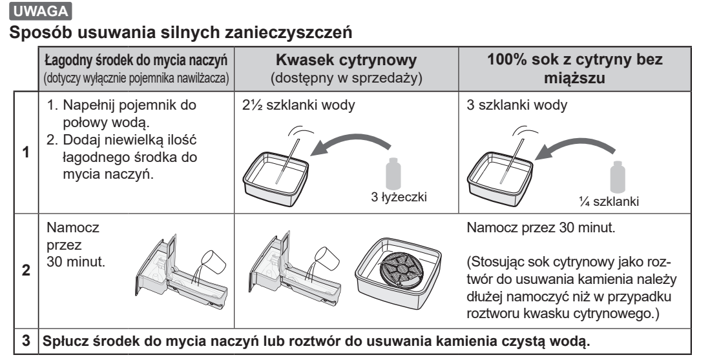

# t6e — Wypłucz filtr nawilżający i tackę

**Sharp KI-TX100EU-W · Co miesiąc**

[Zdjęcie urządzenia](../zdjecia.md#sharp)

> Przed ręcznym czyszczeniem wyłącz urządzenie i odłącz je od prądu.

> Nie demontuj pływaka w tacce. Łagodny płyn do mycia naczyń z tabeli dotyczy wyłącznie tacki.

1. Wyjmij i obficie wypłucz wodą; pozostaw pływak na miejscu.

Jeśli świeci komunikat Maintenance, po zakończeniu wszystkich czynności konserwacyjnych [skasuj przypomnienie](sharp-reset.md).

## Fragment instrukcji producenta

Dotknij rysunku, aby go powiększyć.

**Miesięczne płukanie: wyjmowanie, płukanie i ponowny montaż filtra oraz tacki.**

**Tylko przy silnych zabrudzeniach: sposoby namaczania i dokładne płukanie.**

## Źródło i pełna instrukcja

- [Pełna instrukcja — Sharp KI-TX100EU](../manuals/sharp-ki-tx100eu.pdf): strona PDF 49.

[Wróć do listy sprzątania](../../README.md#sharp) · [Wszystkie krótkie instrukcje](README.md)
