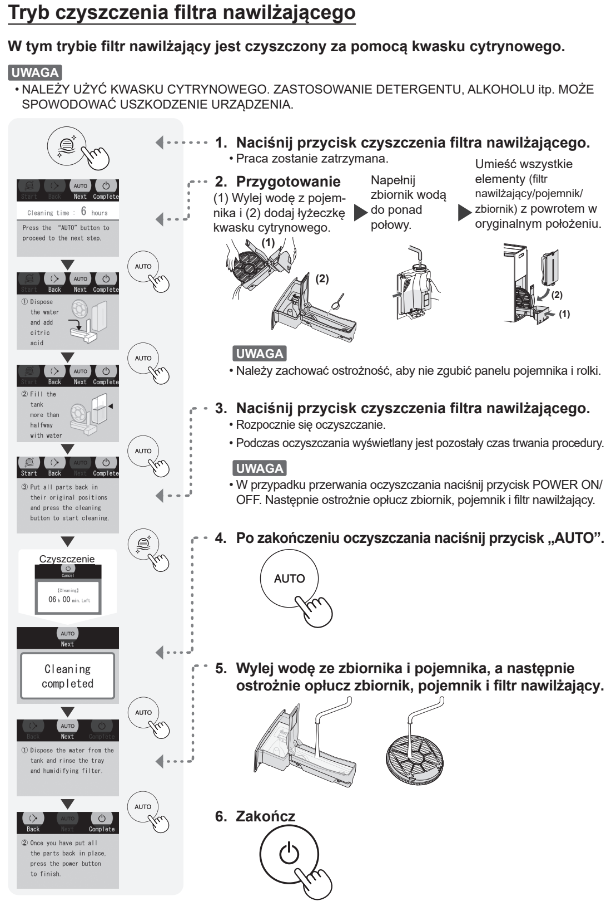

# t6f — Odkamień filtr nawilżający

**Sharp KI-TX100EU-W · Przy osadzie; częściej przy twardej wodzie**

[Zdjęcie urządzenia](../zdjecia.md#sharp)

> Do tego programu używaj wyłącznie kwasku cytrynowego; nie detergentu ani alkoholu.

> Także po przerwaniu programu trzeba wypłukać zbiornik, tackę i filtr.

1. Naciśnij przycisk czyszczenia filtra nawilżającego, aby zatrzymać pracę i rozpocząć przygotowanie.
2. Opróżnij tackę i wsyp do niej 1 łyżeczkę kwasku cytrynowego. Zbiornik napełnij wodą ponad połowę.
3. Zamontuj z powrotem filtr, tackę i zbiornik. Naciśnij przycisk czyszczenia filtra nawilżającego; program trwa około 6 godzin.
4. Po zakończeniu naciśnij AUTO. Wylej wodę ze zbiornika i tacki; ostrożnie wypłucz zbiornik, tackę i filtr.
5. Zamontuj części z powrotem i naciśnij przycisk zasilania, aby zakończyć.

## Fragment instrukcji producenta

Dotknij rysunku, aby go powiększyć.

**Pełny program czyszczenia filtra nawilżającego: przyciski, kwasek, zakończenie i płukanie.**

## Źródło i pełna instrukcja

- [Pełna instrukcja — Sharp KI-TX100EU](../manuals/sharp-ki-tx100eu.pdf): strona PDF 39.

[Wróć do listy sprzątania](../../README.md#sharp) · [Wszystkie krótkie instrukcje](README.md)
