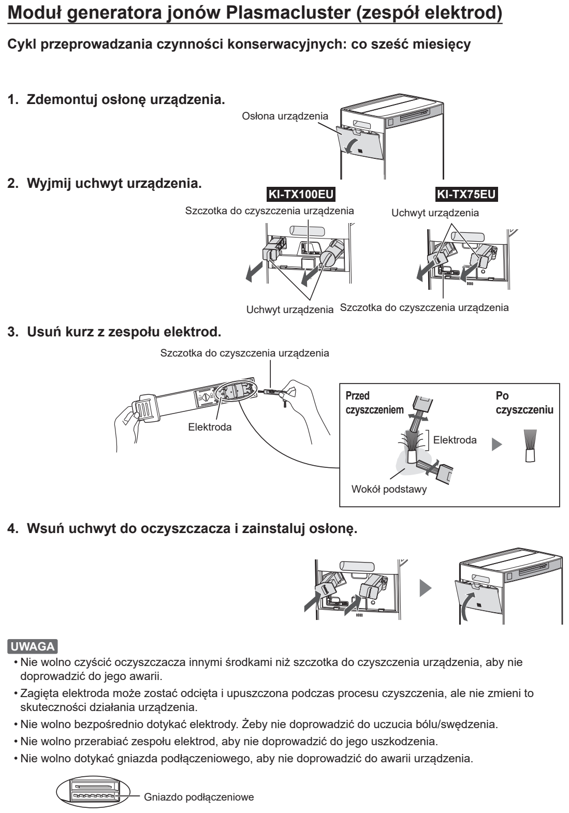

# t6g — Wyczyść elektrody jonizatora

**Sharp KI-TX100EU-W · Co 6 miesięcy**

[Zdjęcie urządzenia](../zdjecia.md#sharp)

> Nie dotykaj elektrod ani gniazda podłączeniowego. Nie używaj innych przyborów niż dołączona szczoteczka.

1. Wyłącz i odłącz oczyszczacz. Zdejmij osłonę modułu.
2. Wyjmij uchwyt według ilustracji KI-TX100EU.
3. Dołączoną szczoteczką usuń kurz z elektrod oraz wokół ich podstaw.
4. Wsuń uchwyt i załóż osłonę.

Jeśli świeci komunikat Maintenance, po zakończeniu wszystkich czynności konserwacyjnych [skasuj przypomnienie](sharp-reset.md).

## Fragment instrukcji producenta

Dotknij rysunku, aby go powiększyć.

**Co 6 miesięcy: wyjęcie uchwytu, czyszczenie elektrod i montaż; ostrzeżenia poniżej.**

## Źródło i pełna instrukcja

- [Pełna instrukcja — Sharp KI-TX100EU](../manuals/sharp-ki-tx100eu.pdf): strona PDF 51.

[Wróć do listy sprzątania](../../README.md#sharp) · [Wszystkie krótkie instrukcje](README.md)
