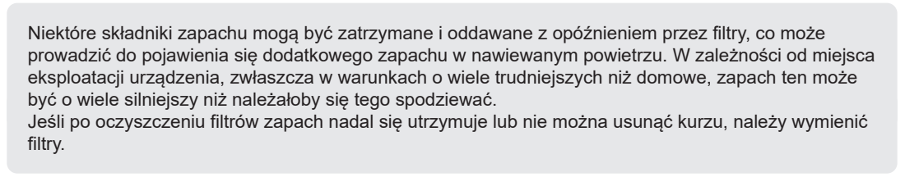
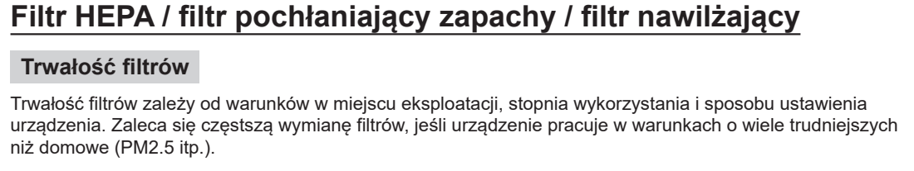
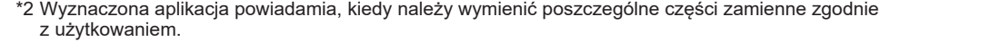
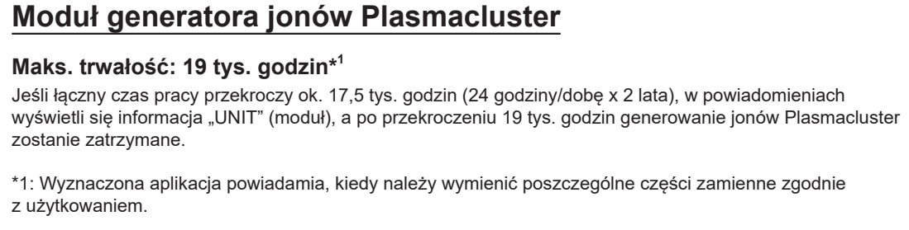

# t6h — Zgłoś potrzebę wymiany filtrów lub modułu

**Sharp KI-TX100EU-W · Gdy zużyte lub po komunikacie w aplikacji / UNIT**

[Zdjęcie urządzenia](../zdjecia.md#sharp)

1. Zgłoś utrzymujący się zapach lub brud mimo czyszczenia filtrów.
2. Zgłoś powiadomienie aplikacji o wymianie części albo komunikat UNIT.

## Fragment instrukcji producenta

Dotknij rysunku, aby go powiększyć.

**Wymiana filtra, gdy zapach lub kurz pozostaje po czyszczeniu.**

**Trwałość filtrów zależy od warunków pracy.**

**Aplikacja informuje o potrzebie wymiany części.**

**Moduł jonizatora: komunikat UNIT i wskazania aplikacji.**

## Źródło i pełna instrukcja

- [Pełna instrukcja — Sharp KI-TX100EU](../manuals/sharp-ki-tx100eu.pdf): strony PDF 50, 52, 53.

[Wróć do listy sprzątania](../../README.md#sharp) · [Wszystkie krótkie instrukcje](README.md)
