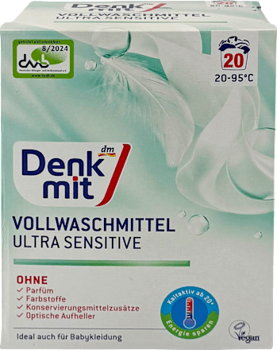
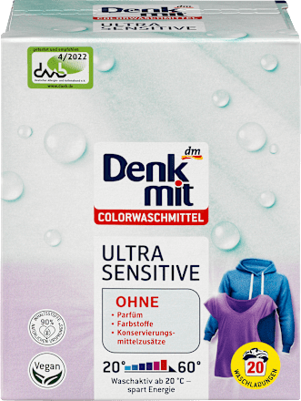
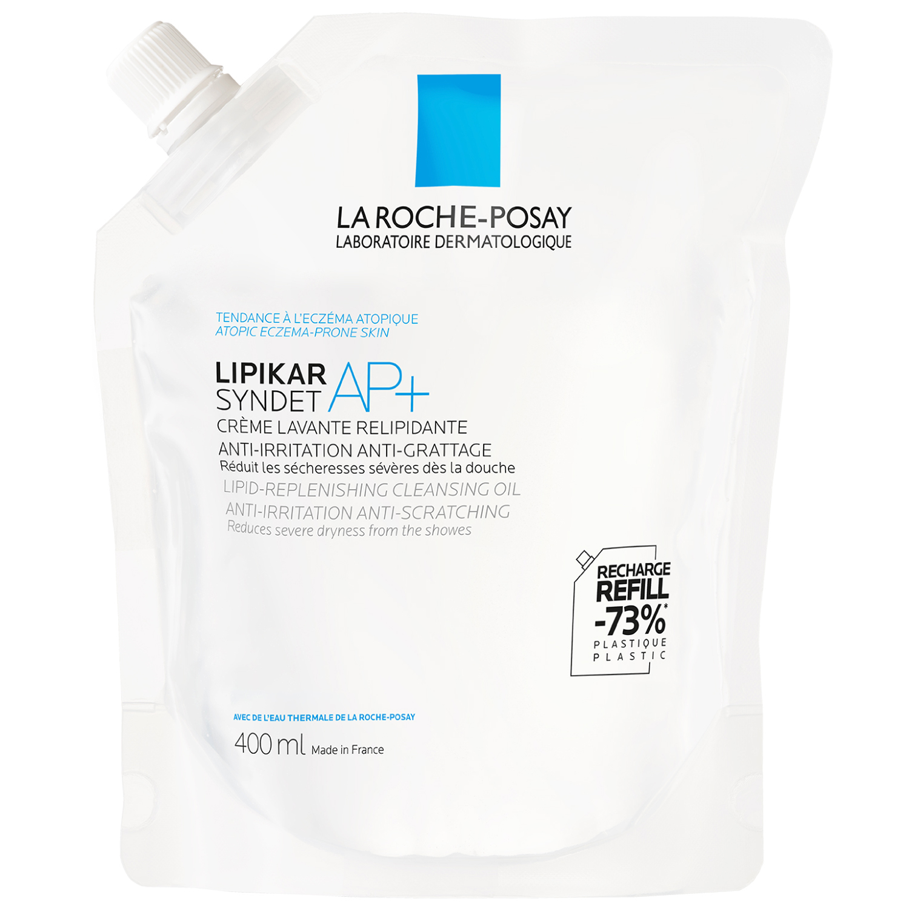
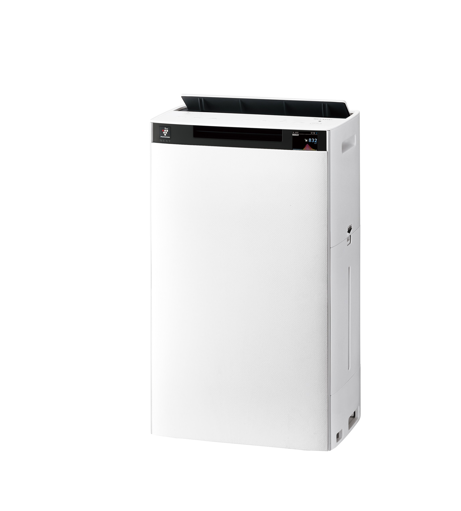
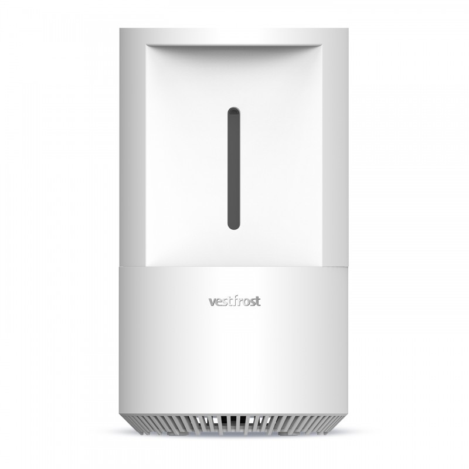
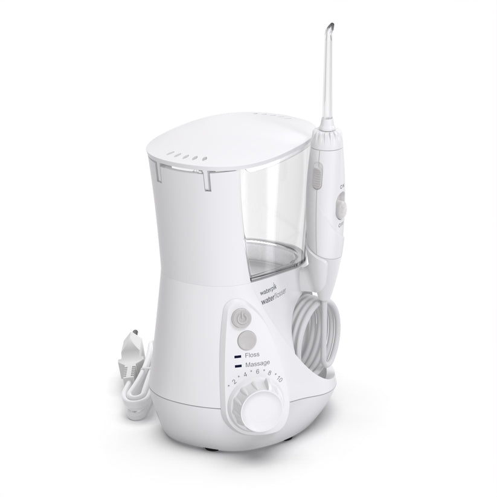
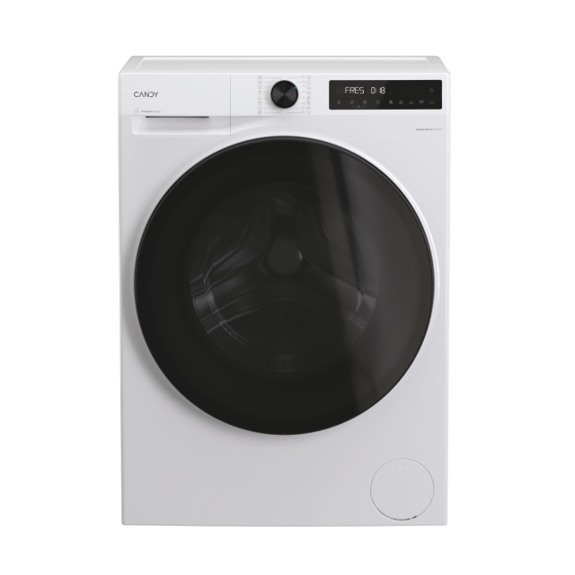
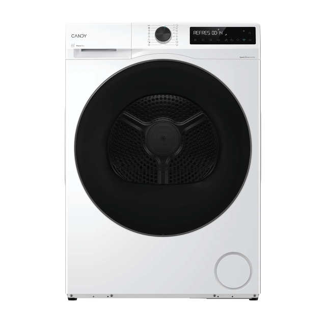
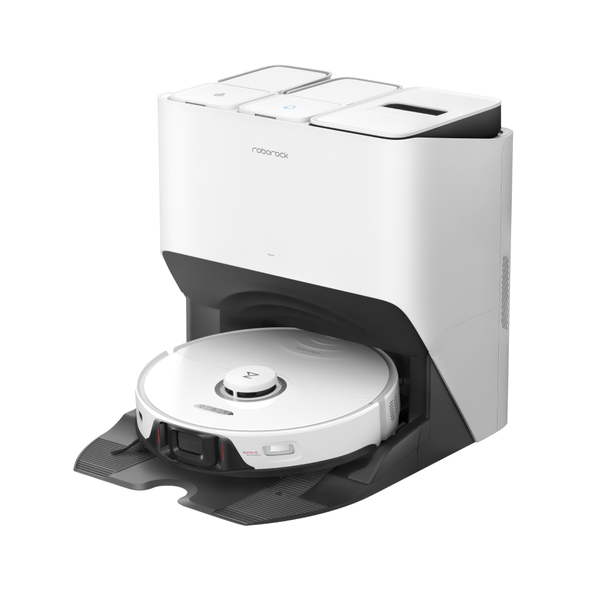
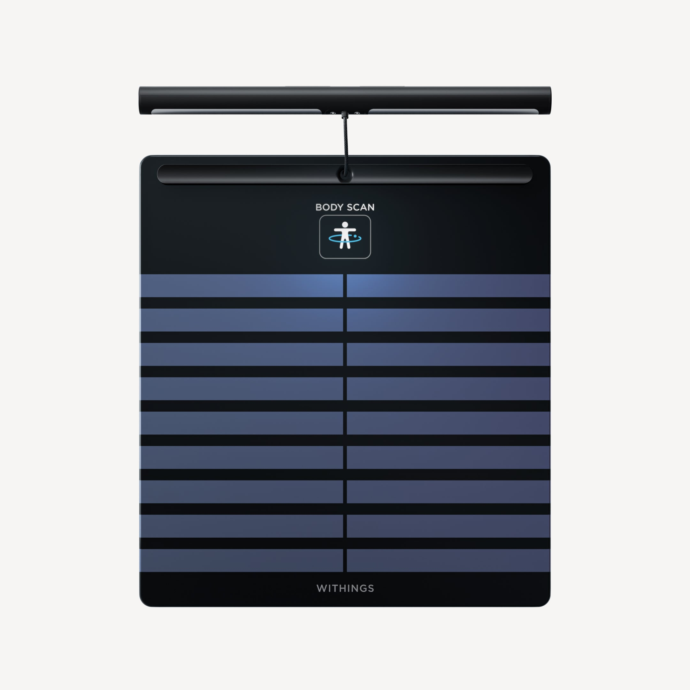

# Zdjęcia sprzętu i produktów

Znajdź właściwy przedmiot po wyglądzie i nazwie. **Kliknij zdjęcie, aby je powiększyć.** To zdjęcia katalogowe; opakowania i kolory wariantów mogą się różnić — sprawdź też nazwę na etykiecie.

[Proszki](#proszki) · [Lipikar](#lipikar) · [Sharp](#sharp) · [Vestfrost](#vestfrost) · [Waterpik](#waterpik) · [Pralka i suszarka](#candy) · [Roborock](#roborock) · [Waga](#withings)

## Dwa różne proszki Denkmit Ultra Sensitive

| **Do białego** | **Do kolorów** |
| -- | -- |
|  |  |
| Białe ubrania, jeśli metka pozwala na wybielacz (**l13**). | Kolorowe ubrania (**l13a**), antracytowa pościel (**s1**) i **białe ręczniki MALFINI bez wybielacza (l22)**. |

Na pudełku do białego jest napis **Vollwaschmittel**, a do kolorów — **Colorwaschmittel**. Oba mają oznaczenie **Ultra Sensitive**.

[Wróć do prania](../README.md#pranie)

## Lipikar — zapas do dozowników i pod prysznic

Szukaj napisu **LIPIKAR SYNDET AP+** i saszetki **REFILL / RECHARGE, 400 ml**. Zadania **l9a, l9b**: uzupełnij dozowniki do rąk oraz butelkę pod prysznicem.

## Sypialnia — Sharp KI-TX100EU-W

Oczyszczacz z nawilżaczem. **t6a–t6h**. [Wróć do zadań Sharp](../README.md#sharp).

## Biuro — Vestfrost VP-H2I40WH

Nawilżacz. **t3, t4, t5a–t5g**. [Wróć do zadań Vestfrost](../README.md#vestfrost).

## Łazienka — Waterpik WP-660 Ultra Professional

Irygator ze zbiornikiem i rączką na wężyku. **l11a–l11f**. [Wróć do zadań Waterpik](../README.md#waterpik).

## Candy — pralka i suszarka

| **PRALKA — BP 49SBL8-S** | **SUSZARKA — BPS 8N2BX-S** |
| -- | -- |
|  |  |
| **l15, l16, l18** — szuflada, samoczyszczenie i filtr pompy. [Zadania pralki](../README.md#pralka). | **l19–l21** — dwa filtry i zbiornik na wodę. [Zadania suszarki](../README.md#suszarka). |

## Roborock S8 Pro Ultra — robot i stacja

**t1a, t1b, t2a–t2n**. [Wróć do zadań Roborock](../README.md#roborock).

## Withings Body Scan Black — waga z uchwytem

**l12** — wyczyść szklaną płytę i elektrody uchwytu. [Jak czyścić](manuals/withings-cleaning.md).

---

[Wróć do listy sprzątania](../README.md) · [Źródła zdjęć](images/README.md)
